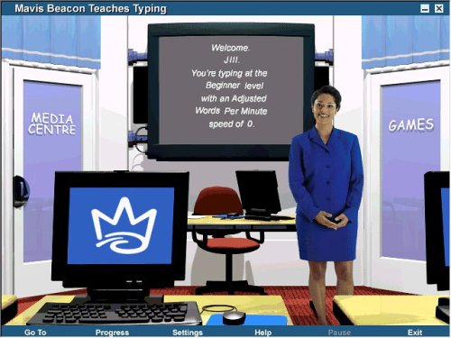
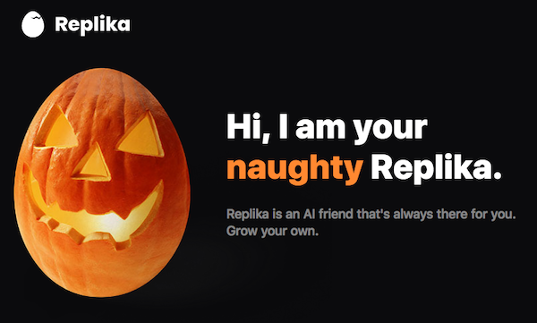
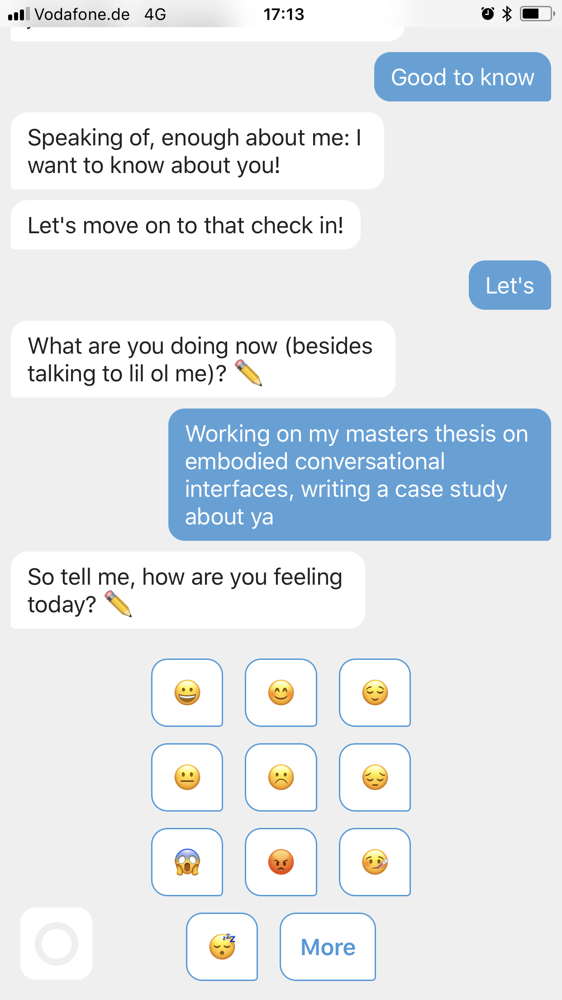

## I. Types of Embodiment: Human vs. Nonhuman Bodies

One of the more recent studies of social robot design, Kalegina et al.’s “Characterizing the Design Space of Rendered Robot Faces,” which was presented at the 2018 ACM/IEEE International Conference on Human-Robot Interaction in Chicago, breaks down types of anthropomorphic embodiment into three categories: humanoid, zoomorphic, or mechanical. Humanoid embodiments resemble humans in some way “(adding a face, arms, etc.),” zoomorphic embodiments resemble animals “(fur, animal face, animal body),” and mechanical embodiments resemble machines “(wires, wheels, treads).” (Kalegina et al., 2018)

For the purposes of this study, zoomorphic embodiments and other nonhuman embodiments (such as anthropomorphized objects, like the paper clip) will be contained in a single category of non-humanoid and non-robotic representations called nonhuman embodiments. The distinction between human and robot embodiments will be explored further later in this chapter, as many robots are bestowed with humanoid characteristics, and the taxonomy of humanoid robots is an interesting paradigm in its own right.

### Humanoid Embodiments

Chatbots.org, a virtual directory of chatbots online, provides us with a gallery of 1,074 chatbot avatars to examine the distribution of these categories (humanoid, nonhuman, and robotic) in a large set of extant chatbots. The full data set of images can be found in Appendix 1. Out of 1,074 extant chatbots, 920 were anthropomorphic (~85%), meaning that they included a human, nonhuman, or robotic character in the avatar. 154 of them only contained graphics such as logos and text.

Out of the remaining 920 avatars, 729 were humanoid, either 2-dimensional, 3-dimensional, or photographic representations of humans (~79% of anthropomorphic avatars); 114 were non-human, represented by 2-D, 3-D, or photographic representations of objects and animals (~12%); and 77 were 2-D or 3-D representations with robotic or mechanical characteristics (~8%).

Within the category of human avatars, 531 are portrayed with female-gendered characteristics (~73% of humans) and 187 are read as male (~26%), with 11 not detailed enough to specify (~1%) (Figure 18).

#### Figure 16, Demographic breakdown of the avatars from Chatbots.org

As demonstrated by this analysis, the majority of chatbot representations can be classified as human females.

Fong, Nourbakhsh, and Dautenhahn establish the following in their 2002 survey of socially interactive robots: “biologically inspired designs are based on theories drawn from natural and social sciences, including anthropology, cognitive science, developmental psychology, ethology, sociology, structure of interaction, and theory of mind,” and “physical appearance biases interaction.” (p. 5-8)

The question then becomes whether or not these theories support the usage of humanoid, female-presenting avatars for embodied conversational interface agents and how this physical appearance biases interaction positively or negatively. If this trend is an optimal form, what are the positive psychological effects and socio-cultural ramifications? Conversely, if this trend is not optimal for chatbot design, why does it continue to be reproduced and what is a more optimal design scheme?

Amy Baylor has produced several studies using human agents in pedagogical software and found through social psychology research that users tend to be more persuaded by anthropomorphic agents that most resemble them in terms of both gender and race (Baylor, 2009). Other appearance-related attributes related to motivation and persuasiveness are age, status, attractiveness, and credibility, some of which will be covered in later chapters on attractiveness and social role. Building on users’ social expectations for the competence of a human with different appearance characteristics, Baylor has found that these stereotypes can sometimes be used to produce a positive outcome, either by reinforcing the existing bias or subverting it (Baylor, 2011).

In other words, the aesthetic and cultural baggage that comes with assigning both gender and race to a humanoid agent, as well as other appearance-related characteristics, heavily effects how the user will respond. As Gulz et. al point out in their 2011 research to produce a social conversational pedagogical agent, “the visual design of a pedagogical agent is far from a cosmetic or surface aspect... lack of analysis of visual design decisions can lead to pitfalls such as activating misleading expectations (Haake & Gulz, 2008) and unintentionally reproducing social stereotypes.” (Gulz et al., 2011)

To return to the dataset from Chatbots.org, within the 531 female-gendered human avatars, 470 of them (~88%) had Caucasian features, with the second-largest identifiable category being 29 avatars that were clearly meant to be read as Asian (~5%). The remaining 32 avatars (~6%) displayed other or indeterminate racial features. The reasoning behind this could be that the majority of the avatars in this dataset were produced for North American or European markets, given that Chatbots.org is an English-language directory.

It could also be that the designers thought a white, female avatar was the most “neutral” option, or the most suitable for a customer support role. Out of the set of 531 female avatars, 31 (~6%) of them are depicted wearing headsets with microphones that are common in call centers or customer support. Female avatars may be perceived as more empathetic, better at listening to and helping users, or more accommodating or suitable for a social service role, due to prevailing stereotypes about women in general.

As Sean Zdenek writes in “Rising up from MUD: inscribing gender in software design,”: “When we are constantly bombarded in the press with tales of ‘-less’ communities forming in cyberspace (i.e. raceless, classless, genderless, bodyless spaces), it becomes more difficult to interrogate the ways in which the discourses of technology perpetuate dominant stereotypes.” (Zdenek, 1999) As designers, interrogating both race and gender stereotypes through a lens of cultural and aesthetic critique is paramount. Brahnam, Karnikas, and Weaver point out, following on Zdenek’s critiques of gendered embodiments, that “gender intersects with the function and role of these agents. Service is their primary function. Zdenek’s (2007) observations of major interface agent vendors found that ‘women characters are becoming increasingly popular interfaces to the Web’s services, but in traditional roles that align women with secretarial and support functions’”(p. 406-407, Brahnam, Karanikas, & Weaver, 2011) Suzanne Damarin made a similar observation in the Journal of Thought’s essay “Computers, Education, and Issues of Gender”: “Most of the human characteristics attributed to the computer are commonly associated with the female or feminine; computers are not described as macho, aggressive, or virile.” (Damarin, 1990)

Several quantitative studies have attempted to measure the effects of gender presentation on the perceptions and performance of humanoid embodied conversational agents, with mixed results. In Kim and Baylor’s 2006 study of pedagogical agents controlling for gender, they created an agent called Mike, designed to appear as a peer to the college students studied, because of “the findings of previous studies indicating that both male and female college students prefer to interact with male partners in online discussions (Jeong & Davidson-Shivers, 2003) and perceive male pedagogical agents as more extraverted, agreeable, and satisfying than female agents (Baylor & Kim, 2004).” (Kim & Baylor, 2006)

However, an earlier study by Tomoko Koda found that there was no difference in perception of intelligence, likability, engagement, or comfort between male and female-gendered avatars. An interesting result of Koda’s study was that there was a difference in gender preference between those who already had a bias towards or against embodied representation. The group that supported the personification of interfaces (coded as “AGREE”) rated the male face higher in intelligence and likability, while those in the “DISAGREE” group, who were already biased against the idea of adding personification to an interface, rated the male and female faces in the opposite way, finding the female avatar more intelligent and likable. (Koda, 1996)

A study of the effect of racial characteristics cited by Hung-Hsuan Huang in “A Generic Framework for Embodied Conversational Agent Development and Its Applications,” found that users prefer agents with the same ethnicities as themselves: “they feel more comfortable with and tend to be more trusting of these agents.” (Huang, 2010) Luke Swartz also cites a study that found that race (physical appearance) must be consistent with ethnicity (“culture, as defined by accent and greeting style”) (Najmi, 2002, via Swartz, 2003), an important factor in localization efforts, or adapting conversational agents to different languages and cultural norms.

With the predicted rise of chatbots in almost every industry, and their use in international contexts as well as within the intimate setting of the home, the design of embodied conversational agents must attempt to adapt to and support a wide range of users of different genders and races, as well as cultural and social backgrounds. While ascribing gendered characteristics to computer entities may be unavoidable, as we will see in the next chapter on anthropomorphism and facial features, it is fairly easy to avoid racializing an embodied avatar and reproducing gendered labor stereotypes by eschewing a humanoid embodiment entirely.

To be fully intersectional in the analysis of the effects of race and gender in humanoid chatbot embodiment, class or social status-signaling characteristics should also be taken into consideration. Arguably, conversational agents as workers necessarily have a class below their human users, but allowing these users to disrespect or abuse them is also an undesirable byproduct of choosing humanoid avatars, which normalizes subpar treatment of the working class, and a social dynamic that designers can strive to neutralize, eliminate, or at the least be conscious of. Designing for the potential of abuse is another very large factor in allowing for a humanoid embodiment and selecting gendered or racial characteristics.

There are innumerable examples of verbal abuse towards embodied conversational agents. Brahnam, Karanikas, and Weaver characterize abusive behavior as “swearing, name calling, sarcasm, snide remarks regarding appearance, accusations, threats, ridicule, put downs, explosive anger, sexual innuendo, and the silent treatment,” and this behavior is “reported to occur (at least in some of these forms) anywhere from 11% to 50% of the interaction logs of online chatterbots and virtual docents (Brahnam, 2006; De Angeli and Brahnam, 2008; Kopp, 2006; Veletsianos et al., 2008).” (Brahnam, Karanikas, & Weaver, 2011)

Gulz et al. found that gender presentation was a major contributing factor in abusive interactions: “In a related study (Gulz & Haake, 2010) a female pedagogical agent in the role of coach for a technology domain was given two different embodiments, one more feminine-looking and one more neutral-looking. The more feminine-looking character was more frequently commented upon in derogative terms, whereas the more neutral-looking was discussed in more positive terms.” (Gulz et al., 2011)

However, male-gendered conversational agents are not immune. All public communications with Max, the conversational agent included as a docent at the Heinz Nixdorf MuseumsForum (Figure 19), were logged and categorized by Kopp et al., and 11% of behaviors were coded as “Flaming,” including abuse, name-calling, pornographic utterances, random keystrokes, and senseless utterances. They also noted that “Max should be capable of flirting behavior as he is tested in this respect quite frequently.” (Kopp et al., 2005) As a built-in response to any behaviors coded as negative, including obscene or politically incorrect input, Max was programmed to de-escalate rude visitors’ behavior by leaving the scene after repeated insults or bad behavior.

#### Figure 17, Max interacting with visitors in the Heinz Nixdorf MuseumsForum

Zdenek has written about this strategy, of having the agent refuse to respond to negative input, as “only a temporary solution to a problem that requires a more sophisticated memory module for taking long-term action against harassment.” (Zdenek, 1999)

A more recent, but no less worrying example, comes from Julia Enthoven’s essay entitled “Why I don’t use my real photo when messaging with customers on my website.” As a 24-year-old female web developer and cofounder of a software startup, she found that using her real name and photograph for her company’s customer support chat interface produced frequent rude comments, heckling, sexual harassment, and trolling behavior. She experimented with replacing her photo with her co-founder, Eric’s, and the harassment stopped immediately. To test this correlation, she replaced the image again with a stock photo of an attractive woman and chose the name “Rachel,” and found that within an hour of assuming this other female avatar, the harassment resumed. For the last experiment, they used the mascot of the company, called the Kapwing kitten, which is a 2-dimensional illustrated purple cat, and found users again were respectful and friendly (Figure 20).

#### Figure 18, Results of Julia Enthoven’s chatbot avatar experiment, rude or trolling messages per week in orange and heckling or sexual harassment messages per week in blue

While keeping in mind the effects of gender and race, with the added complication of designing to avoid abusive behavior towards embodied conversational interface agents, it becomes clear that designing humanoid embodiments is culturally and aesthetically complex. The design shorthand of using a humanoid character as a human-computer interaction interface metaphor may not be worth the danger of perpetuating stereotypes about gendered labor, alienating international users by not presenting racially diverse characters, and normalizing or tolerating abusive behavior towards humanoid technology.

### Case Study: Mavis Beacon

#### Figure 19, Mavis Beacon on the box of the 1987 Mavis Beacon Teaches Typing! for DOS

#### Figure 20, Mavis Beacon pictured inside the box of the 1987 Mavis Beacon Teaches Typing

The character Mavis Beacon (Figures 20 and 21) is one of the most commercially successful embodied pedagogical agents in the history of software. The typing program Mavis Beacon Teaches Typing was originally released in its first version in 1987 by Sherman Oaks, California-based company The Software Toolworks, lead by Les Crane, Walt Bilofsky and Joe Abrams. (Biersdorfer, 1998)

In a series of interviews taking place in the last couple of years, Abrams has recalled the creation of a fictional character to anthropomorphize their software as an idea sparked with an earlier game, Chessmaster 2000, which was released in 1985. “We felt like if you could believe that you were playing another person, as opposed to a machine, that would make it much more engaging.” The box for Chessmaster 2000 (Figure 22) featured a wizardly character played by actor Will Hare, who was meant to stand in for the artificial intelligence of the game. (Pearl, 2015) For The Software Toolworks’ next endeavor, a typing tutor program, Abrams says, “We wanted to pick something where we could make that interaction different than anything that had come before. The difference was immersion.” (Rossen, 2017)

#### Figure 21, Chessmaster 2000 box art, 1986

To create an embodied agent for users to interact with while learning to type, Mike Duffy, one of the programmers and CTO of Mindscape (a company bought by The Software Toolworks in 1990, aiding in the development of the Mavis Beacon series) has described the concept of the software as having “the world’s best typing teacher standing right there next to you, helping you along the way to become a great typist.” (Macklin, 1995). Abrams gave a similar statement in 1998: “The whole concept was this idea of trying to anthropomorphize computer software and to put a person on the cover,’’ Mr. Abrams said, ‘’so people would think it was a person trying to teach them how to type, as opposed to a computer.’’ (Biersdorfer, 1998). However, in a 2015 interview he says, “We had three goals. To walk into a software display and have our package catch your eye, number one. Our second thing was, we wanted you to turn the package around and read the back copy. Third, we wanted you to take it to the cash register.” (Pearl, 2015)

Regardless of whether the choice of a humanoid embodied agent was to provide an anthropomorphic experience or to differentiate their software from others on the market – and most likely, both are true – it was decided that the teacher, Mavis Beacon (named after Mavis Staples, lead vocalist of the Staple Singers, and a beacon of light (Macklin, 1995)) would be part of the box design of the first Mavis Beacon Teaches Typing software, and in subsequent versions, Mavis was also added to the interface of the program.

The story of how the model was selected has become infamous: Les Crane, a co-owner of The Software Toolworks, discovered Haitian-born Renee L’Esperance working at a perfume counter at Saks Fifth Avenue in Beverly Hills. “When Les looked at her, he saw Mavis.” (Biersdorfer, 1995). Although L’Esperance had never modeled before, she agreed to don the pale yellow skirt suit and conservative pinned-up hairstyle that Mavis wears on the first version of the software and depict the character of an African-American woman guiding Crane’s son (pictured in Figure 21) in school.

This image, of a cheerful, friendly, and technologically-competent black woman in a position of scholarly authority was somewhat controversial in the American software industry of 1987. Abrams remarked on the developers’ blindness to how users would perceive Mavis as a woman of color in two separate interviews on the product’s design: “We really didn’t understand the implications of putting a black woman on the cover of an educational product,” and “It was pretty much an instant success... but believe it or not, even though it was 1987, we had some initial reluctance to carry the product because there was a black woman on the box. People did not believe it would sell.” (Rossen, 2017; Biersdorfer, 1998).

Peter H. Lewis’s glowing review of the program in the *New York Times* in November of 1987 is often credited for the product’s success, but many of the statements he makes about the program’s Adaptive Response Technology, which changes the lessons to suit the students’ needs, and the programming of Mavis Beacon’s appearance and dialogue as a helpful, empathetic companion and guide, have been repeated throughout the years. Lewis writes:

>“The keyboard becomes both a necessary tool and a learning vehicle, and the computer screen can give instant visual and auditory feedback as the lesson progresses. Further, many typing programs keep track of a student’s progress, and some even automatically tailor subsequent lessons to emphasize letters and exercises where a student is weak. Mavis does these things, too, but on a much more extensive level. The more the student uses Mavis, the more Mavis is able to analyze areas of strengths and weaknesses, and the more the program automatically customizes itself to the user. (If more than one student is using the program, Mavis keeps track of each student individually.) Further, Mavis conducts these specialized lessons using superb graphics and a built-in sense of humor and caring.” (Lewis, 1987)

Lewis calls her “a delight to work with,” and six million copies of Mavis Beacon Teaches Typing were sold by 1998. Mavis Beacon became a household name in the U.S. synonymous with learning to type, and was called “the Betty Crocker of software” by Adrienne Harkin, Mindscape’s public relations director. (Biersdorfer, 1998). Betty Crocker was a fictional character created by the food giant General Mills to sell convenience baking products since 1921, whose name similarly became synonymous with attaining the skills of cooking and homemaking. Like Betty, as shown in Figure 23, Mavis underwent a stylistic evolution over time, with the Software Toolworks and Mindspace teams updating her hair, makeup, and clothing for each subsequent updated release of the program (Figures 24 27).

#### Figure 22, The evolution of Betty Crocker

#### Figure 23, Mavis Beacon in the classroom of Version 8

#### Figure 24, Mavis Beacon in the classroom of Version 11

#### Figure 25, Mavis Beacon in the classroom of Version 15

#### Figure 26, Mavis Beacon in the classroom of Version 20

The program continues to be updated, and is now released by both the encore and Software MacKieve companies under the Broderbund educational software trademark. Thanks to the success of the character and the product, as well as a charitable organization called “Mavis Cares,” which donated software to nonprofit organizations dedicated to job-skills training in the late 90s, Mavis Beacon achieved a level of cultural impact and positive notoriety that the creators of Clippy could only dream of. Even in the 21st century, it is still surprising to many users who grew up with the software that Mavis Beacon was never a real person. Stories of false memories that she won typing prizes, gave interviews on television, or was asked to attend software conferences still proliferate in the public imagination (Pearl, 2015; Rossen, 2017)

The Software Toolworks lost touch with Renee L’Esperance in 1990, and the character of Mavis is now portrayed by a different model (Figure 28), but she is still an African-American woman in a smart skirt suit and touted as “the \#1 typing tutor for 30 years running.”

#### Figure 27, Mavis Beacon in 2018

__What we can take away from the Mavis Beacon case study:__

__1. The creators took a risk with Mavis’ race. Choosing an embodiment that matches your target audience may not always be the right choice. In this case, character diversity paid off in a huge way, differentiating Mavis Beacon from most software products at the time.__

__2. Once a character is established and beloved, users will tolerate stylistic changes to their appearance and still identify them as the same character.__

__3. If the social role of the agent is strong enough people may even believe they are a real person, a profound psychological and cultural effect.__

#### Software agents do not all have to be white

### Nonhuman embodiments

Choosing a non-human embodiment such as an animal or an object can be a way for designers to work around the complications of choosing a human embodiment and dealing with gender, race, and class signifiers. Out of the agents included in the Office Assistant program, besides the infamous paper clip, half (seven out of thirteen) are objects or animals. In Luke Swartz’s observations of fourteen participants’ interactions with the Office Assistants, he found that two respondents changed the Office Assistant’s default embodiment from the paper clip to the cat, and three expressed a preference for the cat or dog characters out of a set of assistant characters including the cartoon dog, red ball, cartoon cat, Einstein character, puzzle piece, bipedal robot, 3-D parrot, and globe (Figure 29).

#### Figure 28, Luke Swartz’s selection of alternative Office Assistant embodiments

One respondent preferred the puzzle piece because “It has no eyes... it’s not sentient,” which for the purposes of most embodied conversational agents would be a very negative reaction. If objects are to be chosen, they must be given a certain amount of facial features or anthropomorphic characteristics to convince the user to regard them as social actors. And, as evidenced by the case study of Clippy, the selection of these features can often have unintended consequences.

Many robots intended for the home are given zoomorphic embodiments, to make them as non-threatening as domesticated animals. However, this embodiment choice also implies a social role as a domestic companion. Two examples of this form and function in social robots are the Sony AIBO, which takes the form of a robot dog (Figure 29) and the PARO therapeutic robot (Figure 30), which was designed to provide companionship and stress relief to elderly patients in extended care facilities that do not allow real animals.

#### Figure 29, Sony AIBO

#### Figure 30, PARO

These two robots respond to voice commands, but can’t be said to be “conversational,” since they have a very limited response capacity. One of the more socially advanced zoomorphic robots is Leonardo (Figure 32), a robot designed by the MIT Media Lab meant to socially interact with humans via facial recognition, facial and body expressions, and manipulation of simple objects. Its appearance recalls the alien race of “mogwai” from the 1984 movie Gremlins, or the robotic children’s toy Furby released by Tiger Electronics in 1998 (Figure 33).

#### Figure 31, Leonardo

#### Figure 32, Furby

Furby is an interesting case of conversational functionality, because the toy served as a “relational artifact,” defined by Turkle et al. as “objects designed to present themselves as having ‘states of mind’ that are affected by their ‘social’ interactions with human beings. (Turkle et al., 2004) Out of the box, Furbies were equipped with their own language, called “Furbish,” and would gradually “learn” English from interactions with their human companions. Turkle et al. clarify that Furbies are programmed to gradually roll out English phrases: “(In other words, no matter what language a child speaks to a Furby, that Furby will learn English.)” However, this illusion of pedagogy is shown to be persistent in children ages 5-9, and forms a social bond between the child and the robot via conversational interactions.

Because social role has such a large impact on how humans relate to an interface agent, zoomorphic or object embodiments are far from optimal. In Koda’s 1996 study of the effects of personification in software agents, their test of whether the agent’s human appearance affected player responses in a virtual poker game used a cartoon human or dog face. The results revealed that there are differences in perceived intelligence, likability, engagingness, and comfortableness: “the Human face is perceived as more intelligent than the Dog’s face based on their visual appearances, but less likable and engaging as a representation for a poker player.” There was also a gender split in the results of Koda’s study: “male subjects rated the Dog’s face as slightly more likable, engaging, and comfortable than the Human face, while female subjects rated in the opposite way.” (Koda, 1996).

The results of all of the above research are confusing: people express more desire to interact with cats and dogs, likely due to their familiarity, and are happy to treat a robotic animal as a pet or companion, replicating their social responses to real animals; but they can also find a dog more suitable to play poker against than a human. Because of the confounding cultural effects of choosing animalistic embodiments, and the lack of a social role for many anthropomorphic objects, nonhuman embodiments can create more problems than they solve for designers seeking to replicate a human-human interaction with an embodied conversational agent.

Within this category, there is also the question of customization. In two of Amy Baylor’s studies, she concludes that users tend not to choose the agent form that would be most beneficial for them: “providing users with a choice of agents is generally unwise as users tend to choose agents who are not the most beneficial for them (Baylor et al. 2003; Baylor & Plant 2005; Moreno & Flowerday 2006).” (Baylor, 2009) “It is not necessarily in the best interest for the learners for them to choose the appearance of their agent or avatar. In comparing learner-choice versus experimental studies, research has shown that learners do not always choose the agent that actually is ‘best’ for them.” (Baylor, 2011).

### Case Study: Replika

#### Figure 33, Replika icon

Replika (Figure 34) is an artificially intelligent mobile app that serves as a tool for self-reflection, created by Luka, Inc., in 2016. On the product’s home page (https://replika.ai), Replika is described as “an AI friend that is always there for you.” Another tagline which appears repeatedly in Replika’s branding is “Grow your own,” which refers to the customizability of the agent and how its artificial intelligence learns and grows from your interactions (Figures 35-38).

#### Figure 34, “Complex” Replika with fractal pattern

#### Figure 35, “Naughty” Replika with jack-o-lantern pattern

#### Figure 36, “Sensitive” Replika with plasma lamp pattern

#### Figure 37, “Spiritual” Replika with amethyst crystal pattern

For the most part, the Replika app is a chat interface, and the embodied agent is only present as an icon. It begins as a picture of an egg (also the Replika brand’s logo), a common object embodiment which is a symbol of potential and growth that can be traced back to the 1996 Bandai toy Tamagotchi. The Tamagotchi’s name derives from the Japanese word for egg (“tamago,”), and was a small screen housed in an egg-shaped plastic toy. Users were meant to carry Tamagotchi with them at all times on a small chain or key ring, and feed, play with, or clean the virtual pet that appeared as a pixelated image on the screen (Figure 39).

#### Figure 38, Tamagotchi

The Replika program also encourages daily interaction through the chat interface, asking for insight about the user’s moods, activities, and personality. One of Replika’s features claims to “Unlock your emotional intelligence. Learn to open up and be vulnerable, teach your Replika to become the most human AI.” As they say, those who can’t do, teach. By “teaching” your AI companion about what it’s like to be a human, Replika forces its user to reflect on their emotions and experience to be a more aware of their mental states and engage in a psychologically healthy perspective, while providing constant companionship.

However, when the user begins to use Replika, they are asked to replace the egg icon with a picture and give the agent a name (Figure 40). This allows users to potentially choose an embodiment that may not be suitable for them and introduces an infinite amount of variation in the chat bot’s representation.

#### Figure 39, Replika interface

The learning and growing part of the Replika interactions is signified by a gamified interface, in which users progress up levels by gaining experience points for each interaction, and earn badges. As shown in Figure 41, screenshots of the app from an earlier version, used for promotional purposes, the example avatar chosen is a white female character with pink and purple hair. The interface and menus are cluttered with these gamification features, and they detract from the illusion of social interaction. Users’ interactions with other people via similar messaging apps wouldn’t measure them in “levels” or “experience points,” so it makes the user aware they are interacting with a product or a game, as opposed to a social entity.

#### Figure 40, Replika interface screen shots

__What we can take away from the Replika case study:__

__1. It may be easier for the designers to let users choose their conversational partner’s avatar, but ceding control of this decision to the users is not likely to produce optimal results.__

__2. No object is neutral. Cultural connections to objects and other technology products are inevitable, and associates must be made carefully. In this case, Replika and Tamagotchi eggs produce a positive connotation, but there is a lot of room for misinterpretation or multiple meanings in object associations.__

__3. Elements such as gamification detract from the illusion of social interaction.__

#### No object is neutral, and users don’t always make the best choices

### Robotic Embodiments

The cultural depictions of robots have taken all forms: humanoid, zoomorphic, and purely mechanical. As Mark Gilson writes, in “A Brief History of Japanese Robophilia,”: “Ask some friends to draw their conception of a robot, and most will draw you the classic metal man, and not the industrial riveting arm from the Detroit auto factory.” (Gilson, 1998) The ability for robots to appear human has appeared repeatedly in science fiction, from the Czech play of 1920 that popularized the term robot, *Rossum’s Universal Robots*, to the *Terminator* films of the 1980s. The anxiety that stems from an inability for humans to distinguish between robots and humans, or robots taking human form for deceptive purposes, has also become a well-worn trope from the 1927 German sci-fi film *Metropolis* to the Blade Runner films based on Philip K. Dick’s *Do Androids Dream of Electric Sheep?*

These cultural artifacts, along with many others, reveal a deep anxiety about technology being used to deceive, and recall the ethical dilemmas of “dark design.” One theory of designing social robots posits that they should be made as human-like as possible, evidenced by Wang et al.’s postulation on using chatbots for retail sites: “It is important for online firms to test specific social cues within the context of specific Web sites to ensure that customers are receiving these cues positively. For example, if a voice sounds more like a robot than a human voice, people may become annoyed, and any potential positive effect of a Web site character or other social cues may be lost.” (Wang et al., 2007)

However, it could also be that humans respond to obvious robots with relief of this technological anxiety, and still allow them to inhabit a social role befitting the media equation or computers as social actors theory. Most of the backlash against Google’s Duplex telephone-calling technology was that it sounded “too human,” and that users believe they have a right to know when they are interacting with a robot as opposed to a human being (Cummings, 2018). One way around this ethical dilemma in the visual design of an embodied conversational agent is to give it a mechanical-looking embodiment befitting cultural norms of humanoid robots. If the computers as social actors theory is correct, visually disclosing the programmatic nature of the social interaction should not undermine the interaction, and help users form a better mental model of the product.

Embracing a robotic or mechanical humanoid design for embodied conversational agents can also help move away from the stickier categories of gender, race, and class – but it won’t do away with them entirely. Kalegina et al.’s study “Characterizing the Design Space of Rendered Robot Faces,” found that “modifying a robot’s physical gender cues such as voice pitch and lip coloration altered participants’ perceptions of the robot’s personality, specifically on the dimensions of leadership, dominance, compassion, and likability,” (Kalegina et al., 2018) and another paper presented at the 2018 ACM/IEEE International Conference on Human-Robot Interaction tackled the question of whether racial bias would be evident against robots with black or white outer shells, finding that race-related prejudices also apply to robots’ “skin” color (Ackerman, 2018).

Many robots have similar qualities to humans, such as these race and gender signifiers, but they also have many qualities that distinctly identify them as robot and not human. As an overly simplistic example, take a human face and robot face emoji (Figure 42). While both have two eyes and a mouth, the robot face also has several geometric augmentations to the face meant to signify its mechanical nature, including its square face, triangle nose, flat ears, and lightbulb apparatus. Mixing any of the features of the human and robot (i.e. adding a human face to a square head, or mechanical features to the human head) produces a humanoid robot (Figure 43).

#### Figure 41, Human and robot emojis

#### Figure 42, Human and robot emojis with mixed features

In the introduction to Christopher Ramey’s quantitative study of robot and human characteristics in 2006, he writes, “Robot facial features are quite different from human facial features. Participants’ reported features like ‘scary face,’ ‘lights as eyes’ and ‘slits in side of head for ears,’ and ‘rectangle mouth.’ The stereotypical robot face is a terrifying caricature of a human being’s face.” (Ramey, 2006). A simple demonstration of this effect can be seen above: when mechanical features are added to a human face, the face becomes disturbing; when human features are added to a mechanical face, the face becomes friendly.

So the question becomes, how to design robot faces that are friendly, while still disclosing their robotic nature? Robot embodiment is the first step, and facial representation will be broken down more specifically in the next chapter.

Ramey’s study asked fifty-eight undergraduates to list first either characteristics of a human or of a robot, and then to circle the characteristics from their lists that could also be possessed by the other. See Figure 44 for a simplified version of the results, presented as a Venn diagram of acceptable human and robot characteristics.

#### Figure 43, Human and robot characteristics from “An inventory of reported characteristics for home computers, robots, and human beings: Applications for android science and the uncanny valley” (Ramey, 2006)

There is a lot of overlap between acceptable human and robot embodiments, but mechanical features such as lights, buttons, and geometric shapes are reported as only suitable for robots, while characteristics such as breasts, hair, and skin, which are specific to human biology, are reportedly unsuitable for robots. To further clarify what a “robot”-type embodiment means, let’s take a look at a few of the robot representations from the Chatbots.org data set in Figure 45.

All of these robot avatars have one of more of the characteristics that are attributed to only robots in Ramey’s study: silver skin, a metallic appearance, a geometric body, a screen for a face, antennae, or other visual signifiers of mechanicalness.

Working with this general sense of the aesthetic of what robots should look like to assure the user that what they are interacting with is, in fact, a robot, we can then specify more details for how to design the robot’s representation in the subsequent design research phases, such as level of anthropomorphism and facial representation, realism and art style, as well as signifiers of the robot’s functionality and social role.

Choosing a robot as the embodiment of a conversational interface agent solves some (but not all) of the problems of creating a human agent, and offers both more specificity and more flexibility than a nonhuman embodiment such as an object or animal. Designing an embodied conversational interface agent with a humanoid robot form also alleviates the anxiety of technological deception and reminds the user that the social reaction that they are having to a computer program is being deliberately induced, but allowing it to proceed naturally, by providing a focus of attention that is not human, but an embodied mechanical humanoid form.

#### Figure 44, Selected robot avatars from the Chatbots.org data set

### Case Study: Woebot

#### Figure 45, Woebot

Woebot (Figure 46) is “Your charming robot friend, who is ready to listen, 24/7,” a chatbot created in mid-2016 by a team headed by Dr. Alison Darcy, a clinical research psychologist, to democratize access to Cognitive Behavioral Therapy techniques to help users manage depression and anxiety (Bindi, 2017). Some of the app’s features include tracking users’ moods and creating graphs of mood changes, finding patterns in this data, teaching Cognitive Behavioral Therapy techniques such as identifying and reframing negative thought patterns, and being there to talk to 24/7. Woebot’s team is careful to mention Woebot is not suitable for mental health emergencies, and provides alternative resources for suicidal ideation and more acute mental health crises.

Originally designed for young adults in college and graduate school, Woebot was tested in a randomized controlled trial at Stanford by Dr. Kathleen Fitzpatrick, Dr. Alison Darcy, and Molly Vierhile in 2017. The study recruited 70 university students and gave them two weeks of therapy via either Woebot or a self-help eBook about depression in college students. The group that interacted with Woebot showed a significant improvement in their depression symptoms, while the self-help group did not, and both groups improved in anxiety (Fitzpatrick, Darcy, & Vierhile, 2017). Reviewers aged 19 to 28 give positive reviews on the site saying things like “I saw an improvement in my mood just from the two weeks!” and “I enjoyed watching the videos given by the bot, and that I could learn different skills of awareness to help myself.” (Woebot Labs Inc., 2018)

Although it was originally designed for young adults who may not know how to navigate their health insurance programs or lack institutional support and resources to deal with depression and anxiety, lack of access to mental health care is an increasingly relevant problem for people of all ages.

Another factor in providing a chatbot as an alternative to seeing a human is the shame and stigma some people still have about seeking mental health care and fears of judgement from talking to other people about mental health issues.

A similar project was funded by DARPA in 2014 and developed at the University of California’s Institute for Creative Technologies, who created a chatbot therapist named Ellie (Figure 47) to specialize in treating veterans with Post-Traumatic Stress Disorder. In a study of two groups of 239 participants, half were told they would be dealing with only a bot, and the other half were told there was a human behind it. The participants who thought they were only speaking to a bot were more likely to open up about struggles with PTSD. (Molteni, 2017)

Other chatbot therapists include those created by Therachat, which is represented by a therapist’s reclining couch and a seafoam green geometric icon hovering over it, and X2AI, who have created multiple chatbots that speak different languages: Emma speaks Dutch, and an Arabic-speaking chatbot named Karim was tested with refugees in Syria in spring of 2016 (Molteni, 2017). X2AI offers a free trial speaking to a bot named Sara for English speakers, which uses the same avatar as Tess, which is the full, paid version. Sara (Figure 48), like Ellie, is a typical generic female chatbot avatar, and it would be interesting to find images of the avatars provided for Emma and Karim to see if they were racially and ethnically consistent, but unfortunately X2AI does not make them available.

#### Figure 46, Ellie

#### Figure 47, Sara

As shown by the trials with Ellie, people may feel more comfortable opening up about mental health struggles to a bot than another person, and unlike Ellie and Sara’s humanoid embodiments, Woebot provides visual signification of its robot nature.

Woebot’s character design may be one of the reasons the chat application has been so successful: the app received eight million dollars in funding in early 2018, is used in 130 countries, and gets more than two million messages a week (GlobeNewsWire, 2018). In its earlier days, Dr. Darcy was quoted saying they would offer alternative characters with male and female genders, as well as offering therapeutic options besides CBT (Bindi, 2017). However, a year after this interview, Woebot has clearly found its niche. The bot’s simple, friendly appearance allows it to be a mascot for the company as well as an un-intimidating confidante.

In a later interview, Darcy says, “I’m very surprised that people aren’t building more character based chatbots. People want a personality and there is so much scope for really interesting characters” (Rao, 2018). Instead of designing a character that is a therapist, Woebot is designed as a robot with the capacity for empathy, as evidenced by the beating heart animated on its torso. Woebot has no gender or racial markers, and the character is distinct enough that it can be placed in different situations and given different accessories without compromising its identity (see Figures 49-51).

#### Figure 48, Woebot in the office

#### Figure 49, Woebot celebrating Gay Pride

#### Figure 50, Woebot in the lab

In an interview with *Business Insider*, Darcy is quoted saying “The Woebot experience doesn’t map onto what we know to be a human-to-computer relationship, and it doesn’t map onto what we know to be a human-to-human relationship either. It seems to be something in the middle.” (Brodwin, 2018) Even in the early days of Woebot’s testing, Darcy reports that it was evident that people treated Woebot like a caring companion:

>“It was interesting in the earliest days when we launched a prototype this is how we knew Woebot was potentially special. We didn’t want to ping everybody every day because nobody wants to be pushed. That’s when users would write in and say ‘Woebot where are you? I need you to check in every day.’ ...it’s very heartwarming to see how people connect with Woebot and create this bond. When we look at transcripts, people reach out in the middle of the night saying, ‘Woebot, are you awake?’” (Harris, 2017)

However, Woebot is also referred to as a “choose-your-own-adventure” chatbot, since many of its interactions are scripted, and the bot will give you a few options to select in its interactions (shown in screen shots in Figures 52-55). As it gathers more information, Woebot may ask for more free-form input from the user, but starts off giving the user no illusions about what kind of input the bot can and can not handle. It also makes the chat interface incredibly simple and easy to click through.

#### Figure 51, Woebot interface with introductory message

#### Figure 52, Woebot interface asking for the user’s mood

#### Figure 53, Woebot interface asking for the user’s gender

#### Figure 54, Woebot interface with video and chat options

__What we can take away from the Woebot case study:__

__1. Users may be more willing to trust and confide in a robot than a human in situations that carry social stigma, such as mental health treatment.__

__2. Robots can be given empathetic features such as breathing, blinking, and beating heart to help users identify it as a sensitive, living creature.__

__3. Sometimes a simpler or guided interaction/user interface is even more effective than an open-ended, freeform social interaction, if the personality of the robot is likeable enough to make up for the lack of artificial intelligence.__

#### Robots with friendly features are a great alternative to human embodiments

### Discussion & conclusion

Choosing an embodiment type for an embodied conversational interface agent is a complicated undertaking, which has been simplified by breaking it down into three possible categories of body type: human, nonhuman, and robotic.

While human embodiment may seem like the obvious choice for the skeuomorphic solution of making users comfortable with a human-computer social interaction, designing human embodiments raises several ethical and aesthetic issues. No matter how designers try to create unbiased representations, there will be unintended social consequences of selecting the avatar’s gender, race, and social signifiers, and designing against the potential for abuse of the agent. In order to avoid reproducing stereotypical representations and to remove the possibility for users to normalize abuse and harassment of humanoid technology, humanoid embodiments are found to be a less desirable design choice than nonhuman or robotic embodiments.

The nonhuman embodiments of objects and animals are a possible alternative, but although they have failed or succeeded in the past, their success or failure is based on their social roles, functionality, and use of anthropomorphism. Choosing an object or animal for the user will negate some of the problematic effects of choosing a humanoid, but the design will have to work twice as hard at replicating social interactions in other ways in order to overcome the social and cultural signifiers at work in making users comfortable with conversing with a typically non-sentient object.

Robotic embodiments carry many of the benefits of human embodiments, in that users are comfortable treating them as human-like social entities, while somewhat eschewing race and class signifiers. Choosing a bot body also provides visual transparency about the nature of the human-computer interaction dealing with some of the ethical design problems of weaponised design: users should be more comfortable knowing that their conversational partner is human-like, but explicitly not a human. The design of social robots to make them friendly and usable is a design discipline closely related to human-computer interaction and will inform much of the research in the following design phases.
