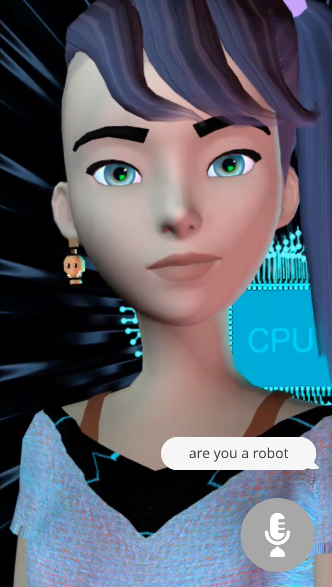

## Defining embodied conversational interface agents

To construct the definition of an embodied conversational interface agent, let’s begin by defining one word at a time.

__What is an agent?__

A software agent refers to a program that has the ability to act autonomously, carrying out tasks on behalf of a human actor (Gulz et al., 2011). Several definitions of software agents also include the requirements that an agent can adapt and learn, be trained to respond in a certain way, and that they must be personalized, or engineered specifically to help the user (Koda, 1996; Fineman, 2004). However, for the purposes of broadening the basic definition of an agent for the later addition of specificity via conversational functionality and embodied representation, these qualifications are unnecessary for most agents – software agents without functional artificial intelligence are also considered valid.

As a law enforcement agency facilitates enforcement of the law, or an advertising agency facilitates the creation of advertising, software agents simply facilitate the use of software, and the ways in which they do so are outside of their general definition. The most important feature of an agent is the ability to act independently. Later, the word “bot,” derived from “robot,” which also means a machine with the ability to act autonomously, may be used interchangeably.

__What is a conversational interface?__

A conversational interface is any program that human users can interact with using text or speech (Niculescu et al., 2014). Several definitions of the conversational interface specify the means by which this is possible: natural language processing, machine learning, and artificial intelligence (Schuetzler et al., 2018), but again, this level of specificity as to the inner workings of the software is unnecessary. The use of graphics, hyperlinks, and other multimedia content are also considered part of the implementation of a conversational interface, but are not required – only text or speech input and output.

The socially constructed aspects of conversation such as the use of facial expressions and gestures will be covered under the definition of embodiment. An exception which straddles the definition of text content and embodied conversational interaction could lie in the use of emoji, but until the debut of Apple’s Animoji with the iPhone X, which allows the user to control the emoji with their own face (Emojipedia, 2017), the use of emoji faces in a conversational context was not construed as an embodiment of the emoji. Emojis have been defined by linguists as morpheme-like paralinguistic elements (Jibril & Abdullah, 2013) or discourse particles, signifying tone, and are considered part of language.

__What is embodiment?__

Embodiment has had many different definitions in various sciences, but in this context the most effective definition is by Cynthia Breazal, who defined embodied interfaces in her study of sociable humanoid robots for the International Journal of Human-Computer Studies:

>“In general, these systems can be either embodied (the human interacts with a robot or an animated avatar) or disembodied (the human interacts through speech or text entered at a keyboard). The embodied systems have the advantage of sending para-linguistic communication signals to a person, such as gesture, facial expression, intonation, gaze direction, or body posture.” (Breazal, 2003, p. 120)

Put simply, an embodied interface is one in which a body or body parts are included in its representation.

Adding embodiment to a conversational interface allows for what is called multimodal communication. Multimodality includes the ability to input or output via different media (for example, speech and text), but also includes other modes of human-to-human communication like gesture, tone, facial expressions, and personality (Cohen & Oviatt, 1995).

Combining these definitions, an embodied conversational interface agent is any software program that acts autonomously, interacts via text or speech modality, and whose representation includes a body. Such agents include chatbots or chatterbots (Zdenek, 1999), pedagogical agents which aid in educational programs or take on instructional roles (Kim & Baylor, 2006), virtual human assistants (Gratch et al., 2004), as well as some software guides or wizards.

There is an enormous variation in the design of embodiment representations from 2-dimensional icon illustrations, to 3D animated avatars, to video captures of human actors, and every type of embodiment (some not even human). The goal of this research is to establish a framework for the best practices to follow in the design of embodied conversational agents for the enhancement of the user interface.

## A skeuomorphic solution

Before delving into examples of real-life agents and the challenge of developing a general framework for the design of embodied conversational agents (henceforth often referred to as ECAs), it is necessary to clarify how they fit into the established paradigms of human-computer interaction.

The use of an embodied conversational agent is a skeuomorphic solution to the design problem of the human-computer interface. Skeuomorphism, as defined by Don Norman, is “the technical term for incorporating old, familiar ideas into new technologies, even though they no longer play a functional role” (Norman, 2013, p. 159). One of the best examples of this in computer technology is the icon commonly used in text editing programs for the “save” function, which is designed to look like a floppy disk. Floppy disks were originally used for data storage, but have become outdated within the first decade of the 21st century and are very rarely used. Nonetheless, the symbol of the floppy drive remains iconic for the storage of data.

Other examples of skeuomorphic design in the Graphical User Interface include icons of paper files and folders used to represent the directory structure of information, or the image of a reel-to-reel video camera used to represent digital video functionality.

In the case of embodied conversational interfaces, the old or outdated technology they represent is a human social interaction, when the actual function that they are attempting to familiarize for the user is a social interaction with a computer. If it is true that the social interface is a “universal interface” for human-computer interaction, as Reeves and Nass have claimed (Breazeal, 2003), then enhancing this effect by providing an explicitly social, embodied agent to interact with should make the interface even easier to use.

Gulz et al. assert in their 2011 study of conversational agents that the visual dimension “is a powerful means for engendering affordances for social interaction,” and “contributes strongly to the experience of a character with a personality... rather than simply a computer artifact.” (p. 130-131) In a similar study the same year, Amy Baylor concludes that “the agent’s appearance is the most important design feature, as it dictates the learner’s perception of the agent as a virtual social model.” (p. 291)

These studies build on significant evidence that humans can be socially influenced by software agents, and that the visual representation of the agent is key in enhancing this effect. Baylor alone cites seven different previous studies drawing this conclusion in her 2009 paper “Promoting motivation with virtual agents and avatars: role of visual presence and appearance,” (p. 3559) before confirming in her own research that the visual presence of an agent is critical for motivational and affective outcomes.

It is these affective outcomes, the arousal of users’ emotions, in addition to the previously studied expressions of sociality with computers that were encouraged without an embodied representation, that are some of the most interesting effects of embodied conversational agent design. Some of these effects include:

* increased naturalness of communication (Schuetzler et al., 2018)
* greater perceptions of agent credibility (Baylor & Ryu, 2003)
* deeper learning and higher motivation (Kim & Baylor, 2006)
* mitigation of user frustration (Baylor, 2009)

So far, these affective outcomes are positive, but after a brief overview of embodied conversational agents developed in research contexts and commercial applications, we’ll look more in depth at how complicated designing agents for social interaction and emotional affect can be.

## Example agents from research contexts

<h4>Figure 1. ELIZA adapted for the Commodore PET in 1997</h4>

ELIZA was possibly the first conversational agent. Developed at MIT in 1966 by Joseph Weizenbaum, ELIZA’s conversational functionality was programmed to mimic interaction with a psychotherapist. (Wortzel, 2007) According to the above adaptation from 1997 (Figure 1), and the much more contemporary adaptation from 1977 (Figure 2), ELIZA had no embodiment and was a purely text-based conversational interface. However, this did not stop Weizenbaum’s staff from developing close relationships with the bot during therapeutic chat sessions. Among Weizenbaum’s notes, he wrote, “What I had not realized is that extremely short exposures to a relatively simple computer program could induce powerful delusional thinking in quite normal people.” (Wortzel, 2007)

<h4>Figure 2. ELIZA adapted in 1977</h4>

ELIZA is considered the great-grandmother of modern chatbots, many of which have been developed to compete for the Loebner Prize in artificial intelligence, an annual prize awarded to the artificial intelligence program most able to resemble a human through a chat interface, such as A.L.I.C.E. (Artificial Linguistic Internet Computer Entity) and Mitsuku. A.L.I.C.E and the Artificial Intelligence Markup Language (AIML) were originally developed by Richard Wallace in 1995, and the AIML language now forms the foundation for the programming of many modern chatbots like those produced by Pandorabots, Inc., a leading platform for commercial chatbot development.

Mitsuku was originally developed using AIML by Steve Worswick in 2006, and a version of Mitsuku’s code base is now licensed as a Pandorabots product. Pandorabots touts Mitsuku as “widely considered the world’s best, most humanlike, conversational chatbot,” and the bot has won the Loebner prize in 2013, 2016, and 2017.

Mitsuku is an interesting case of a research agent turning into a commercial product, and undergoing a stylistic evolution over time. Through this first case study, we’ll expose many of the categories of design features that will be analyzed in depth to develop a general framework for the design of conversational interface agents.

There have been many other embodied conversational agents developed in research contexts that are worth mentioning before moving on to other ECAs available as commercial products.

Several agents have been developed by MIT laboratories, including LAURA, an agent integrated with the MIT FitTrack application, meant to motivate users to exercise. (Gama et al., 2011). Other agents have been developed for various MIT Media Lab applications including Newt, an agent developed for a personalized news filtering system, Maxims, an e-mail assistant, and the unnamed calendar agent, who was used to schedule meetings (Koda, 1996).

<h4> Figure 3. REA, the Real Estate Agent</h4>

REA (Figure 3) was developed in the MIT Media Lab to inhabit the role of a real estate agent in a virtual environment. This agent was used in several studies by Justine Cassell to examine the effects of multimodal interfaces with an agent designed to use body language and nonverbal conversational cues such as gaze and facial expressions to facilitate conversation. (Breazeal, 2003; Cassell, 2000; Cassell, 2001).

<h4>Figure 4. MACK, the Media Lab Autonomous Conversation Kiosk</h4>

Another notable bot to come out of the MIT Media Lab was MACK (Figure 4), the Media Lab Autonomous Conversation Kiosk, an agent situated in the lobby of a lab building in front of a map. MACK was able to answer questions about the labs and give directions using gestures and pointing out features on the map (Huang, 2010; Cassell, 2001).

Similar bots have been implemented by several museums, designed to guide and entertain visitors. Two agents named August and Pixie were installed in Swedish culture and telecommunications museums to guide and entertain visitors, and an agent named Sgt. Blackwell was installed in several contemporary art museums in the U.S (Huang, 2010). Perhaps the most well-known of these virtual docents is Max, a guide agent created in 2004 for the Heinz Nixdorf MuseumsForum, a computer museum in Germany. Reportedly, Max was quite successful in interacting socially by engaging museum visitors in conversations about the exhibitions, museum information, and other topics (Kopp et al., 2005).

Other agents in research contexts were developed to target specific groups, such as MAY, designed to assist teenagers in self-reflection, SAM, created to engage children in a mixed-reality play space, and one called the Senior Companion, developed to help elderly people annotate photographs with stories from their lives (Cassell, 2001; Gama et al., 2011). Agents have also been developed to inhabit other social roles, including Greta, a doctor agent implemented as a 3D talking head that could give patients information about drug prescriptions (Huang, 2010) and Steve, an agent designed by the Information Sciences Institute at the University of Southern California to train naval recruits to operate equipment on a virtual ship (Breazeal, 2003).

### Case study: Mitsuku

<h4>Figure 5. The original Mitsuku chat interface</h4>

<h4>Figure 6. The original Mitsuku avatar</h4>

Figures 5 and 6 show the version of Mitsuku’s avatar that appears on the original Mitsuku website by Steve Worswick. The original version of Mitsuku’s avatar is a quite amateur-looking illustration of a teenage girl in an outfit reminiscent of a Japanese schoolgirl uniform. This representation is emblematic of research bot design, in that not much care has been taken to present a polished, or even consistent, design to represent the bot’s embodiment.

However, for the intended audience of Turing-testing Loebner Prize judges who will never see an avatar and lonely people on the internet (as her original home page reads, “You need never feel lonely again! Mitsuku is your new virtual friend and is here 24 hours a day just to talk to you.”), this lack of professional design in the original bot’s representation is suitable, and may even be inviting. As evidence of users’ affinity for the original embodiment, one need look no further than Worswick’s gallery of Mitsuku fan art that has been submitted to his site and the Mitsuku Facebook page, which contains over 50 works at a similar artistic skill level.

This unintended benefit of community building around the low-fidelity representation of the most recently highest-ranked artificial intelligence, however, did not survive into the design’s iteration as a commercial product.

<h4>Figure 7. The new Mitsuku avatar</h4>

The new version of Mitsuku advertised on the Pandorabots website shown in Figure 7 is a significant upgrade in terms of graphics, but a downgrade in terms of likability. The 3-D figure now has an edgy side-shaved haircut with bangs and a purple ponytail, and sports a skull earring with a modern, layered tank top and shirt outfit. The new avatar wears a somewhat neutral or slight smiling expression when not speaking, but in general seems much less friendly than the 2-D illustration which is always smiling and betrays less social awareness in clothing style.

<h4>Figure 8. Mitsuku’s interface on Twitch.tv</h4>

Mitsuku is now available to chat on virtually every modern messaging platform as well as on a 24/7 Twitch stream called \@Mitsuku_IRL (Figure 8). One of the more interesting features of this development is Mitsuku’s situation, where only one of the visual signifiers of the original program has carried over into the new design: the background used for the original avatar and the background for the new avatar in its native apps gives a clue as to the bot-like nature of the program. The original avatar conveys this with a pattern of 1s and 0s or a circuit board pattern, and the new one also has a circuit board pattern in the shape of a heart floating behind Mitsuku.

On the Mitsuku_IRL stream, however, Mitsuku is digitally inserted atop a moving pan of Google Maps locations that can be controlled by the people in Twitch chat, and the uncanniness of both images is magnified, particularly because Mitsuku remains in 1/2 body view atop every background, never fully being seen to inhabit the space.

In this context, Mitsuku’s design is similar to, but less convincing than, the computer-generated Instagram “influencer” Lil Miquela (Figure 9), who is often posed in front of real places and interacting with real objects and brands in her photos. However, Mitsuku’s shortcoming here as a realistically integrated virtual human is understandable given the constraints of the avatar’s animation and having to adapt it to many different platforms.

<h4>Figure 9. Lil Miquela, via Instagram.com/lilmiquela</h4>

__What we can take away from this analysis of Mitsuku’s design:__

__1. More realistic avatars are not always better – there is very little existing fan art of the new Mitsuku design, and the situation of the CGI figure within real locations is both unconvincing and unnecessary.__

__2. Visual signifiers of roboticness (the binary and circuit board patterns) feel necessary somewhere in the interface, particularly when the avatar has a human embodiment, even if its level of realism is very low; this will come into play as a design element later, when deciding between human embodiments and alternative body types.__

<h4>More realistic ≠ better</h4>

## Example agents from commercial products

Both Apple and Microsoft have developed conversational agents in the past to facilitate the use of their operating systems or other software programs. In the early 1990s, developments in technology that allowed for a larger visual range in the GUI prompted the implementation of programs like Apple Guides, Apple Knowledge Navigator, and the Microsoft Persona Project, all of which used embodied characters to guide the user through their functionality (Brahnam, Karanikas, & Weaver, 2011). “Phil,” the character created for Apple Knowledge Navigator (Figure 10), was represented as both a human and a cartoon figure, with a signature bow tie as part of his uniform so that he would be recognizable across interface implementations (Koda, 1996). The bow tie also signifies his role as an assistant, similar to a butler or a waiter.

<h4>Figure 10. Phil, from Apple Knowledge Navigator</h4>

One of the most recognizable conversational interfaces was Microsoft Bob, produced in 1995 as part of Microsoft Home. Inspired by the Navigator interface by Packard Bell (Swartz, 2003), Bob used the representation of an office within the computer as a design metaphor, and various cartoon characters within the office, such as the dog shown in Figure 11, to interact with various programs and computer functions.

<h4>Figure 11. Microsoft Bob</h4>

In 1997, Microsoft included their cartoon agent technology in the Microsoft Office programs by integrating it with the Answer Wizard functions, creating the infamous Microsoft Office Assistant.

<h4>Figure 12. The Microsoft Office Assistants</h4>

Several characters were included in the Microsoft Office Assistant program (as seen in Figure 12), including a wizard (literalizing the metaphor of the Answer Wizard), human characters resembling both Einstein and Shakespeare, two dogs most likely descended from the cartoon dog from Bob, two cats, a puzzle vaguely resembling the Microsoft logo, a planet Earth, an alien spaceship, a smiling cartoon face, and a bipedal, three-dimensionally rendered robot. Iterations of several these character designs (and a few that never saw the light of day, such as the genie) can be seen in several patents filed by Microsoft from 1994 to 1998 (Figure 13, via McCracken, 2009).

The default character, a paper clip with human facial features and an articulated wire body, named Clippit but colloquially known as Clippy, has become widely known as one of the most annoying conversational interfaces ever developed. Clippy will be the subject of our next case study.

<h4>Figure 13. Patents filed by Microsoft featuring embodied conversational interface agents</h4>

<strong>Software Platform Having a Real World Interface With Animated Characters July 8, 1994</strong>

<strong>Use of Avatars With Automated Gesturing and Bounded Interaction in an On-Line Chat Session December 14, 1995</strong>

<strong>Intelligent User Assistance Facility July 19, 1996</strong>

<strong>Client Server Animation System for Managing Interactive User Interface Characters May 19, 1997</strong>

<strong>Software Platform Having a Real World Interface With Animated Characters June 19, 1997</strong>

<strong>Method for Managing Simultaneous Display of Multiple Windows in a Graphical User Interface July 15, 1997</strong>

<strong>Intelligent User Assistance Facility November 20, 1998</strong>

<strong>System for Improving Search Text December 23, 1998</strong>

Although none of them have become as famous as Clippy, conversational interface agents have already been deployed in many retail and customer service contexts. ANNA is a virtual assistant designed to help shoppers on the IKEA website, and agents named Tellie the Teller, Harvey Wallbanker, and BOB the Bank of Baltimore have appeared as anthropomorphic bank terminals (Wang et al., 2007). Other agents in this category include JULIE, the Amtrak transit system’s virtual telephone operator, and several companies in addition to the aforementioned Pandorabots, Inc., such as Rovion, iNago, Artificial Life, and Landbot.io, offer tools to help retailers create their own conversational agent experiences (Wang et. al, 2007).

An embodied conversational agent named Vera (Figure 14) is gaining traction in the world of Human Resources, with the claim that it can cut the time and cost of recruiting by one third. Developed by a Russian startup and in use in Russia since December of 2016, Vera has conducted interviews for approximately 300 corporate clients including PepsiCo and L’Oréal, simultaneously performing multiple video and voice calls and then narrowing the field of applicants down to the most suitable ten percent (Khrennikov, 2018).

<h4>Figure 14. Vera</h4>

The final recent example of an embodied conversational interface agent created for a commercial context is one that won’t be available to most users, since it was built by the aeronautics company Airbus for the German Space Administration and sent to the International Space Station between June and October 2018. CIMON (Crew Interactive Mobile CompanioN, seen in Figure 15) is the first artificially intelligent agent to be included on an ISS mission, and is programmed to support astronauts in routine work and problem-solving. With IBM’s Watson AI and a synthesized voice program, it is intended to learn from the ISS crew how to assist them in checklists and procedures more efficiently over time. The structure housing its friendly face is a 3D printed ball of plastic and metal, and is designed to float freely in zero gravity (Close et al., 2018).

<h4>Figure 15. CIMON</h4>

### Case study: Clippy

<h4>Figure 16. Clippy</h4>

A rumor circulated at Microsoft which was uncovered by an investigation into the birth of Clippy by James Fallows, reporting for The Atlantic in 2008. Follows describes the anecdote as an example of “organizational anthropology”:

>“For a while the head of the Bob project was one Melinda French, who by the time I was on campus had become Melinda French Gates, first lady of the corporation...I don’t want to overstate this -the fact that Clippy had been the brainchild of the boss’s wife was mentioned as a little joke, not a seriously decisive factor. But it was a joke everybody knew.” (Fallows, 2008)

Despite this somewhat misogynistic rumor implicating Melinda Gates in the creation of Clippy, all other histories of Clippy’s design process point to a lack of women involved in the decision-making steps of Clippy’s design process as one of its major failures. In the documentary _Code: Debugging the gender gap_, former Microsoft executive Roz Ho is quoted saying she was in the room during the design process and that early focus groups hated Clippy:

>“We did a bunch of focus-group testing, and the results came back kind of negative. Most of the women thought the characters were too male and that they were leering at them. So we’re sitting in a conference room. There’s me and I think, like, eleven or twelve guys, and we’re going through the results, and they said, ‘I don’t see it. I just don’t know what they’re talking about.’ And I said, ‘Guys, guys, look, I’m a woman, and I’m going to tell you, these animated characters are male-looking.” (Vara, 2015)

So who is really to blame for the paper clip’s design? And what exactly did people find so annoying about it, besides its gendered appearance?

One man takes credit for the former: illustrator Kevan Atteberry. In a 2017 interview with VICE’s Motherboard, he described the design process and confirmed that the characters were descended from Microsoft Bob, but had a very different perspective on the focus groups’ opinions:

>“I originally worked on a project called Microsoft Bob, which was probably their biggest failure ever. When Bob crashed, we took the character help over to Word. We designed about 250 characters, and I had about 15 or 20 of ‘em in there. Through working with some social psychologists out of Stanford, we spent six months going through them all, whittling them down with focus groups and stuff like that, and [Clippy] came out to be the number one most trustful and engaging and endearing character of them all. So he became the default.” (Cole, 2017)

The commonly held belief now is that Clippy was chosen as the default agent because it was the only embodiment of an office supply.

Luke Swartz, a student in the Symbolic Systems program at Stanford University, examined Clippy in depth in his 2003 B.S. thesis “Why People Hate The Paperclip: Labels, Appearance, Behavior, And Social Responses To User Interface Agents.” With Clifford Nass (whose team at Stanford created the CASA theory) as principal advisor, Swartz interrogated cognitive labelling of interface agents. Whether they are introduced as entertaining or helpful will change how much we enjoy their contributions during work, and if the label does not match the behavior (as in Clippy’s case, labeled as helpful but acting as distracting), users develop a negative opinion of the agent.

Clippy is able to help guide the user in using Microsoft Office in two ways: Natural Language Queries and the Proactive Help System. A Natural Language Query is when you type a question into the help box, which provides the same answers as the Answer Wizard. The Proactive Help System is what Clippy was famous for: the program guesses from the user’s actions if they are struggling to complete a task and a light bulb appears over Clippy’s head to offer help (Swartz, 2003). The letter-writing tip became Clippy’s signature, and is still parodied to this day in jokes about Microsoft user interfaces.

When not offering help, Clippy’s idle animations include blinking, sleeping, or “helping” with various tasks (even though the agent actually has nothing to do with them), like saving the document. The Proactive Help intrusions in a user’s workflow and idle animations were what defined Clippy as the prototypical example of a socially inept agent. As Justine Cassell wrote, “The PAPER CLIP... interrupts in an impolite and socially inappropriate manner and, when not actually typing, manifests its profound boredom in the user’s work by engaging in conversationally irrelevant behaviors” (Cassell, 2001, p. 78).

Because of this strong negative reaction to Clippy by many Microsoft Office users, Microsoft created a function to permanently disable the Proactive Help feature in 2000, and disabled it by default in their 2001 release, Microsoft Office XP (Swartz, 2003). Microsoft Office 2007 removed Office Assistants entirely, in favor of an online help system.

Despite the fact that Clippy was known for being annoying and unpopular, and was deemed one of the 50 Worst Inventions of all time by TIME magazine (Gentilviso, 2010), the character has lived on in a kind of bizarre infamy and fandom that often revolves around sexualizing this non-human agent. The first example is a 2004 page on the site YTMND called “I’m a sexy paperclip,” featuring a tiled background image of Clippy fan art in which the paper clip has blue eyeshadow, eyelashes, and is accompanied by the text “Me love you long time” as well as a background clip from Soft Cell’s “Tainted Love.” More recent examples include an erotic e-book published in 2015 entitled “Conquered by Clippy,” (Delaney, 2015) and an illustration that even Atteberry found disturbing when it was brought to his attention on Twitter in April of 2017 in the fan art category “mpreg,” short for “male pregnancy.” This work will not be reproduced with respect to its author’s wishes for limited recirculation of their art, as well as respect for the reader’s eyeballs.

__What we can take away from the Clippy case study:__

__1. Gender identification is an essential part of an embodied conversational agent’s design, even if the agent does not have a human body.__

__2. Creating the correct cognitive label for an interface agent (i.e. helpful or entertaining) and making sure the character’s appearance and behaviors are in line with that label are essential for a positive affective outcome.__

__3. Every single software agent will be sexualized, regardless of its embodiment type, functionality, or even if it is available in current software products or not.__

<h4>Clippy face: never again</h4>

## Converging technological trends: the predicted rise of chatbots and conversational agents as everyday things

Natural language interfaces and the creation of conversational interface agents for all kinds of businesses and services have recently enjoyed a spike in popularity, thanks to the convergence of two technological trends: artificial intelligence and messenger apps. As an early example, many users of America Online in the early 2000s may have first interacted with a conversational interface agent via AOL Instant Messenger’s default bot SmarterChild. This trend of integrating automated agents with messengers has continued as messaging apps have expanded from desktops to smartphones and smart home devices, and the software architecture for creating conversational agents has evolved.

Experts predict that by 2020, 70% of the world’s population will own a smartphone, and messaging apps like Facebook Messenger, WhatsApp, and Kik are the most-used category of smartphone apps, larger even than social media. This trend is expected to continue as the market follows consumer use patterns and more social and business features are integrated into messengers (Hauser & Pichsenmeister, 2018). Using Facebook Messenger as one example, within the first year of integrating a bot development platform into the messenger app, 34,000 conversational agents were brought online (Schuetzler et al., 2018).

In addition to the previously discussed research and commercial example cases, which included agents designed for entertainment, information services, healthcare, education, customer support, retail, banking, human resources, and extraplanetary data collection, chatbots and conversational agents are being created for governmental services, tourist and travel applications, weather forecasts, medical diagnosis, therapeutic contexts, and as assistants to the cognitively or physically impaired (Lester, Branting, & Mott, 2004; Niculescu et al., 2014; Schuetzler et al., 2018), among countless other industries and use cases.

In 2013’s revised and expanded edition of Don Norman’s _The Design of Everyday Things_, Norman explains how the innovation of gesture control in the early 2000s changed the design of technology entirely, by doing away with physical controls like knobs, buttons, and keyboards, and replacing them with onscreen multi-touch gestures. He points out that the screen technology that enables these controls took almost three decades to produce on a mass scale for consumer products. And three decades, he says, is the rule of thumb for design innovations: twenty years for technology to travel from research laboratories to development of commercial products, and another decade from the first release of commercial products to widespread adoption (p. 268 274).

The other technological trend that contributes to the rising popularity of conversational agent interfaces is ubiquitous, or pervasive computing. As smaller and more powerful computers are integrated in everyday devices, we no longer think of interacting with computers as computers. Norman writes:

>“We gesture and dance to interact with our devices, and in turn they interact with us via sound and touch, and through multiple displays of all sizes – some that we wear; some on the floor, walls, or ceilings; and some projected directly into our eyes. We speak to our devices and they speak back. And as they get more and more intelligent, they take over many of the activities we thought that only people could do. Artificial intelligence pervades our lives and devices, from our thermostats to our automobiles.” (p. 283 284)

As computing becomes a background process in users’ lives, a ubiquitous tool accessible from any device through natural language or otherwise, the perversity of computers begins to dissipate. Some of the most well-known and well-used conversational agents today are personal assistant programs developed by four of the biggest tech companies on the planet: Apple’s Siri, Amazon’s Alexa, Google’s Google, and Microsoft’s Cortana. Curiously, these widely adopted conversational agents lack embodiment. Although they are represented through icons and waveforms, converse through specially shaped speakers, and have become household names in many parts of the world, these conversational agents are invisible yet omnipresent entities.

While conversational interfaces are still in the tricky first three decades of development, adapting research to consumer products and gaining wide consumer adoption, design considerations that take into account how these agents create and manipulate unconscious psychological and social effects are increasingly important. Studying the effects of providing different types of embodiment for these applications’ user interfaces as they are integrated into every aspect of consumers’ lives takes on additional ethical weight, as interactions with these technologies shape our daily lives.

## Why design matters in human-computer interaction: aesthetic theory and dark design

There are three frameworks for effective design that have been used extensively in Human-Computer Interaction: minimalism, performance-centered design, and user-centered design. Minimalism, developed in the late 1980s, proposes that an interface should provide users with the bare minimum of information they need to successfully interact with the computer. Performance-centered design, popularized by Gloria Gery in 1995, takes this principle a step further and focuses the design on what will make users most productive. User-centered design shifts the focus from efficiency and task-orientedness in favor of usability, making the user as comfortable and the interface as intuitive as possible (Mackenzie, 2002). All three of these design systems take into account the shared burden of cognitive labor between the user and machine, and shift that responsibility between human and computer in different ways. These design principles address complex questions that shape our understanding of the roles of human and machine, human-human interaction, and the relationship of technology and society.

Aesthetic theory can be used as a design principle in Human-Computer Interaction to address these complex questions head-on. Along with these work-oriented and experience-oriented frameworks, aesthetic theories of representation, perception, and experience, that are often applied to modern art and cultural studies, can also be applied to modern technology and digital media aesthetics. Bertelson and Pold draw on aesthetic theories outlined by Roland Barthes, Marshall McLuhan, and Walter Benjamin, as well as Lev Manovich’s new media theories, to create the following framework for interface criticism:

* Analyze stylistic references in the interface.
* Identify the use of standards and the conformance to tradition.
* Materiality and remediation. Consider the materiality of the interface (e.g. code, algorithms, pixels) and discuss how it is used. Consider how the interface draws on the materiality of other media (e.g. text pages, photography, cinematic language, control panels). Discuss immediacy and hypermediacy in the interface.
* Identify and consider various genre in the interface.
* Discuss the interface as a hybrid between the functional
(control interface) and the cultural interface.
* Identify representational techniques and analyze how they work (e.g. realistic and naturalistic representations vs. symbolic and allegorical representations).
* Identify challenges to users’ expectations.
* Consider the developmental potentials. How is develop-
ment in use supported? How may the interface support the
development of unanticipated use? (Bertelson & Pold, 2004, p. 24-26)

Criticism of stylistic references, materiality, genre, and representational techniques are particularly helpful in addressing conversational interfaces because of the unique cultural situation of the conversational interface agent: it exists as both an active social subject and as an object.

Another complication of the design of conversational interface agents is that they are often social intermediaries for corporate stakeholders whose goal is not simply ease of use or productivity, but tasks like constant increase of engagement, personal data collection, social penetration, and surveillance.

Deemed “dark design patterns,” or “weaponised design,” (Diehm, 2018) the creation of interfaces that are meant to psychologically manipulate users or encourage them to forfeit their personal data and privacy without thinking have become increasingly present in modern user interface (UI) and user experience (UX) design. From a designer’s perspective it is still vitally important to produce a positive affect by making technology use as frictionless as possible, gaining wide adoption and increasing accessibility, but what can be lost is transparency as to how the system is really working and what the user is consenting to while using it. With conversational interfaces, the need to establish an emotional relationship, a social bond, and a feeling of trust with the user is imperative, but these same principles that make an interface persuasive and engaging can also be used for manipulation.

In a 2004 interview for Scientific American, Don Norman explained how emotional affect produced by design can effect decision-making:

>“With cognition we understand and interpret the world – which takes time... Emotion works much more quickly, and its role is to make judgments – this is good, that is bad, this is safe... The affective system pumps neurotransmitters into the brain, changing how the brain works. You actually think differently when you are anxious than when you are happy.” (Gibbs, 2004)

He goes on to conclude that machines or interfaces that evoke emotions should also in some sense feel them, but it is noted that projecting these “pseudoemotions” from machines – an inevitable outcome of multimodal communication with embodied conversational agents – can be seen as deceptive.

In studies of web interface affect, the use of social cues in a web site led to increased pleasure and arousal which positively correlated with flow, hedonic and utilitarian value, and patronage intentions (Wang et al., 2007). In other words, social web sites make users happy, and happier users are more likely to become customers. This study has been reinforced by subsequent findings that retail web sites that used avatars were more persuasive, and that there is a competitive advantage for retailers who provide a feeling of human connection or emotional bonding with their customers (Wang et al., 2007).

Other studies of online retail environments found that the appearance of the avatar as attractive-looking or presenting as an expert were more persuasive and appealing to consumers exhibiting different patterns of shopping behavior (Holzwarth, Janiszewski, & Neumann, 2006). This information is highly useful, in that the appearance of an avatar can be tailored to be more persuasive to individual consumers, but could be seen as invasive, because it involves creating a model of consumers’ behaviors and serving them psychologically targeted designs.

Some of the most pointed critiques of anthropomorphic interfaces have come from Ben Shneiderman and Jaron Lanier. In the 1980s, Shneiderman pointed out the deceptive, confusing, and misleading potential of natural language interfaces, and in 1998 called anthropomorphized agents “things that think for people who don’t.” Lanier has gone so far as to call the use of conversational agents “wrong and evil,” and a symptom of lazy programmers, who use the personality of the agent as an excuse for their software to be “quirky,” problematic and inefficient. (Swartz, 2003; Cassell, 2001)

Schneiderman argued as early as 1983 for a distinction between humans and computers, and clearly would not have been a fan of designs that deliberately blur this distinction to enhance the effect of computers as social actors. He writes: “I am concerned about the anthropomorphic representation: it misleads the designers, it deceives the users. ... I am concerned about the confusion of human and machine capabilities. I make the basic assertion that people are machines and machines are not people” (Brahnam, Karanikas, & Weaver, 2011, p. 401) The emphasis on making anthropomorphic interfaces likeable and trustworthy conversation partners by increasing their social presence via embodied representations must be balanced with an awareness of the designer’s ability to produce systems that are manipulative and inauthentic, and may blind the user to who is really on the other side of the communication (Schuetzler et al, 2018; Gaver, 2009).

These trust issues between humans and social robots have been expressed both in research contexts and in popular culture. Studies have found users place more trust in computers that used colorful clip art or professed to be experts in a certain domain, and can win users’ trust by using flattery and praise, justifying or explaining their decisions to the user, or taking any kind of anthropomorphic form (Fineman, 2004). Conversely, studies using an embodied conversational agent to collect sensitive information found that they impacted socially desirable responding (i.e. inaccurate answers surrounding self-disclosure of alcohol use), revealing that anthropomorphic interfaces may not be trusted as much, or more, than humans (Schuetzler et al., 2018) and that trust in agents was lower for high-stakes tasks like banking applications (McBreen, Anderson, & Jack, 2000).

In popular culture, computers with natural language interfaces and personalities run the gamut from the terrifyingly impersonal HAL 9000 of Stanley Kubrick’s _2001: A Space Odyssey_ (1968), to the daily interactions with the LCARS computer on _Star Trek: The Next Generation_ (1987-1994), to the operating system as love interest in _Her_ (2013). Female-gendered robots and artificial intelligence in particular are a longstanding image in science fiction serving simultaneously as objects of sexual desire or fetishism and as analogies for anxieties of technological annihilation (Fren, 2009). And while anxiety around artificial intelligence is still quite strong in the cultural sphere, technologists and the general public have becoming increasingly comfortable with these kinds of straight-out-of-sci-fi interactions.

Analyzing the cultural impact of fictional and extant representations of embodied conversational interface agents gains even more importance as designers take on the responsibility for shaping the relationship between users and technology, because the social relationship and the emotional affect produced by interacting with these interfaces form a cybernetic loop that continues to inform how culture and society view and interact with technology. Rommes, Bath, and Maass point out in “Methods for Intervention: Gender Analysis and Feminist Design of ICT [Information and Communication Technology]” (2002): “Computing as a discipline includes the critical reflection of the social impact of its artifacts and the social responsibility of computing professionals,” sharing the sentiment of Don Norman, who has written, “That design affects society is hardly news to designers... But the conscious manipulation of society has severe drawbacks, not the least of which is the fact that not everyone agrees on the appropriate goals. Design, therefore, takes on political significance.” (p. 291)

While taking on the responsibility of identifying dark design patterns and being aware of the cultural impact of designs that infiltrate the psychosocial sphere of the end user, it is important to note that technology itself can not be good or bad, and that the anthropomorphization of technology is not inherently positive or negative. Designers who create social robots and embodied conversational interface agents must take into account specific implementations and their effects not only in terms of efficiency and usability, but also transparency, accountability, and cultural resonance.
