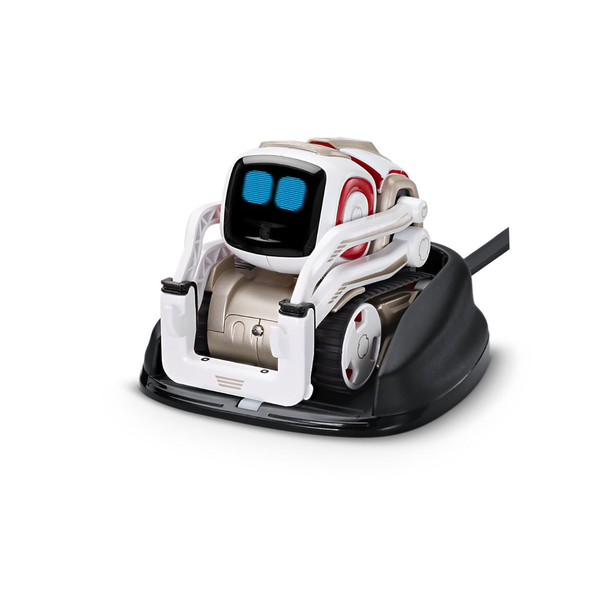
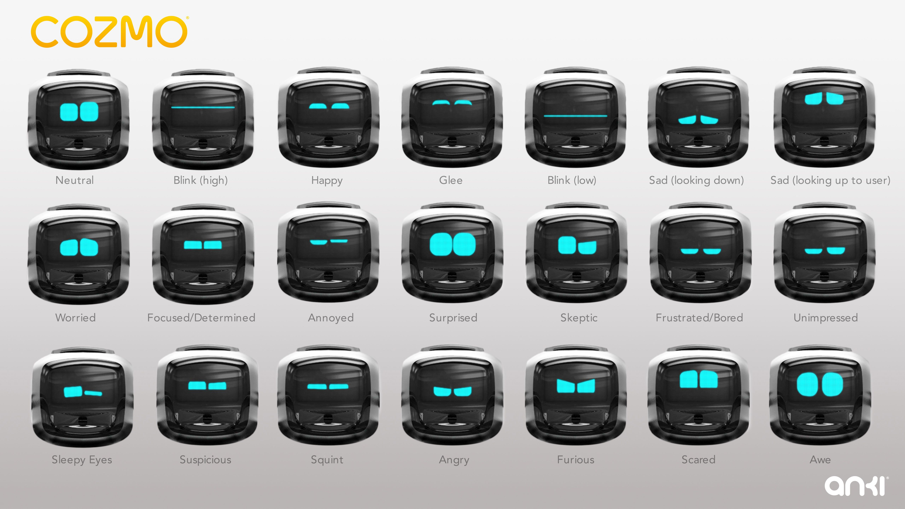

In the design of social robots, and in the design of embodied conversational agents, having a face may be more important than having a body (although technically, the face is part of the body). Human psychology is eager to engage with anything that even slightly resembles a human face. Regardless of embodiment type, the face is going to be the focal point of any social communication.

The question to be answered in this design phase is how to design the faces of conversational interface agents, building off of human psychological effects like anthropomorphism and pareidolia. What elements are necessary for communication, engagement, affinity, and creating emotional responses? How can humanoid robot faces be designed to seem as likeable, friendly, intelligent, and trustworthy as possible to facilitate human-computer interactions?

## Why faces work: anthropomorphism and pareidolia

According to Denis Vidal, writing for the Journal of the Royal Anthropological Institute, there has been an increased interest in the effects of anthropomorphism across diverse fields of study in the last thirty years: “From the 1990s onward, there has been a new interest in re-evaluating the significance of anthropomorphism, noticeable in a variety of disciplines such as anthropology (Boyer 1996; Guthrie 1993), prehistory (Mithen 1996), media studies (Reeves & Nass 1996), cognitive psychology (Karmiloff-Smith 1996; Thelen & Smith 1993), and so forth.” (Vidal, 2007)

In this paper, “Anthropomorphism or sub-anthropomorphism? An anthropological approach to gods and robots,” Vidal goes on to analyze parallels between the relationships humans have developed with regards to technological artifacts and religious ceremonies in the Western Himalayas. As stated in previous chapters, drawing on social sciences such as anthropology and psychology can be very useful in helping to predict the effects of design in human-computer interaction and robotics.

Anthropomorphism is defined as the human behavior of “attributing human characteristics or behavior to a god, animal or object” (Waytz, Cacioppo, & Epley, 2010). There are two ways this is expressed: the first is by attributing physical characteristics such as human faces to non-humans, and the second is the attribution of a humanlike mind.

Attributing human physical characteristics to nonhuman objects, particularly notable when interpreting physical features as facial representations, is an effect psychologists call pareidolia. “We cannot help but see faces in everything rock formations, clouds, the front of a car, the windows and doors of a house... Faces can be abstracted or simplified by a huge degree and still remain recognisable, a useful characteristic for comic and caricature artists and robot designers. Minimal features or dimensional relationships are all that is required to suggest a face, and our brains ‘fill in the gaps’.” (Blow et al., 2006) Several examples of objects that induce this phenomenon can be seen in Figure 56.

<h4>Figure 56. Examples of pareidolia</h4>

This effect has been tested through empirical studies that show that “consciously or not (and often not), most of us display a similar tendency with most of the objects with which we are confronted in our environment, especially if they have big expressive eyes or any other human or animal features (DiSalvo & Gemperle 2003; DiSalvo, Gemperle, Forlizzi & Kiesler 2002).” (Vidal, 2007) It is even noted by Waytz, Cacioppo, and Epley that in automobile and motorcycle design in particular, engineers take care to convey specific impressions with the facial resemblance of the front of the vehicle. “It is well demonstrated that human aesthetic preferences transfer to nonhuman objects and beings (Norman, 1992; Kanwisher, 1997; Breazeal, 2002; Fong et al., 2003).” (Hanson, 2006).

Inducing the effect of pareidolia is one way to ensure anthropomorphization of an object, but as defined earlier, anthropomorphism goes further than only insinuating human physical characteristics; it also implies a human mentality and affective capability, which are essential to treating an object as a social actor. Waytz, Cacioppo, and Epley list intentionality, conscious awareness and cognition, secondary emotions such as shame or joy, moral care and concern, and responsibility and trust as just a few of the previously human-exclusive attributes that are applied to anthropomorphic objects. Another effect, which is relevant to the previous design phase of choosing embodiment and designing for the potential for abuse of technological agents, is that anthropomorphism is part of how people decide what should be treated with the respect and dignity afforded to other humans and what should not.

Waytz, Cacioppo, & Epley go on to summarize research in anthropomorphic technology and list several examples with proven social and psychological effects:

>“One study has demonstrated that anthropomorphizing an alarm clock and a robot (as well as a dog and a series of shapes) makes these agents appear more understandable and predictable (Waytz et al., 2009). Other studies demonstrate that anthropomorphic avatars appear more intelligent (Koda & Maes, 1996) and more credible (Nowak & Rauh, 2005) than nonanthropomorphic ones. Anthropomorphic computer interfaces tend to increase engagement (Nass, Moon, Fogg, Reeves, & Dryer, 1995), and appear more effective in collaborative decision-making tasks (Burgoon et al., 2000)... People also present themselves more desirably to a computer interface that has a human face than to one that is purely text-based (Sproull, Subramani, Kiesler, Walker, & Waters, 1996), and they behave more cooperatively in an economic game when humanlike eyes are presented on the computer screen (Haley & Fessler, 2005)... People are more likely to treat anthropomorphic interfaces as scapegoats when the technology malfunctions (Serenko, 2007), and they feel less responsible for success on tasks that use humanlike interfaces (Quintanar, Crowell, & Pryor, 1982).” (p. 226-227)

It is also important to note that the effects of anthropomorphism and pareidolia are subconscious. In a study by Sherry Turkle, it was found that students “establish personal relations with their computers and then reject those personal relationships, often expressing disbelief at their own tendencies and abilities to establish caring relationships with machine personalities (Turkle and Papert, 1990).” (Damarin, 1990) This effect was more pronounced in women learning to program computers: they had an increased likelihood of forming these relationships, while consciously resisting or denying the anthropomorphic effects.

Tomoko Koda’s “Agents with faces” study found that controlling for the conditions “Face” and “NoFace” for her poker-playing agents supported the hypothesis that there is a difference in perceived intelligence, likability, engagingness, and comfortableness between agents with and without facial representations. Subjects rated the agents with a face as more likable, more engaging, and more comfortable to play with, regardless of their opinion on personification of user interfaces. (Koda, 1996) A more recent study in 2013 found that attributions of agency varied between robots with a human-like face display, a silver face, or no face at all, and results suggested that even the presence of the “uncanny” silver face could promote perceptions of agency. (Kalegina et al., 2018)

Two studies, Kalegina et al.’s “Characterizing the Design Space of Rendered Robot Faces,” (2018) and DiSalvo et al.’s “All Robots Are Not Created Equal: The Design And Perception of Humanoid Robot Heads,” (2002) performed systematic analyses of robot facial features.

Kalegina et al. define the face as “the top frontal portion of a robot that includes at least one element resembling an eye,” and worked with a data set of 157 robots with faces rendered on a screen. After coding all of the features of these faces across 76 dimensions, they administered a questionnaire to 50 workers about twelve specific robots with mechanical or robotic embodiments that spanned a range of facial detail. The workers, sourced from Mechanical Turk, were asked to rate them on scales of dislike-like, masculine-feminine, machinelike-humanlike, untrustworthy-trustworthy, unintelligent-intelligent, unfriendly-friendly, and childlike-mature. Some of the more interesting observations to be drawn from these results are shown in the ratings for dislike-like, untrustworthy-trustworthy, unintelligent-intelligent, and unfriendly-friendly, pictured in Figure 57.

<h4>Figure 57. Ratings of robot faces from Kalegina et. al (2018) for Dislike-Like, Untrustworthy-Trustworthy, Unintelligent-Intelligent, and Unfriendly-Friendly with results averaged and error bars indicating standard deviation</h4>

The most liked robots are between the 6th and 10th most realistic (Furo-D, Yumi, Datou, and Buddy, reproduced left to right in Figure 58). All of these robot faces have eyebrows, very large and circular eyes, pupils or eye reflections, small mouths, and three have cheeks or blush as well.

<h4>Figure 58. Furo-D, Yumi, Datou, and Buddy</h4>

Furo-D, the robot most resembling a human female, was also one of the most highly ranked on the scales of trust, intelligence, and friendliness. This result makes sense based on the human biases discovered in the previous chapter regarding race and gender, that users tend to prefer agents that are most like themselves, particularly in terms of race, and the ethnicity distribution of the workers surveyed was 72% White/Caucasian, 16% Asian or Pacific Islander, 6% Hispanic or Latino and 6% Black or African American. Given that Furo-D is one of only two robots with human-like coloration and can be read as a Caucasian or Asian face, it possibly should have been excluded from this set of rendered faces; scores for EMC may have been similarly inflated due to its Caucasian features.

Furo-D was also ranked as more human-like than even the most realistically detailed face on the scale, Valerie, which Kalegina et al. chalk up to “the different screen size and orientations; while FURo-D looks like a human wearing a helmet, Valerie is clearly a rendering of a floating human head on a larger screen.” They also observed in the results that overall preference did not favor Valerie or EMC because respondents found their high level of realism “creepy” – this effect will be explored more in the following chapter.

The robots that performed most poorly on the dislike-like, trust, and friendliness scales were Sawyer and Gongzi (Figure 59), both of which have more realistically proportioned eyes and very few other facial features, particularly no mouths. Where the more liked and friendly robots stare with wide eyes and slight smiles, these robots stare with blank, seemingly judgemental expressions, based on the level of detail above their eye area, with nothing on the lower portion of the face to balance the effect of their eyebrow/eyelid weight. Kalegina et al. also surmise that Gongzi may have been perceived differently if its large eyes contained pupils.

<h4>Figure 59. Sawyer and Gongzi</h4>

To further deconstruct the effects of individual facial features on the perception of robot faces, Kalegina et al. created a set of 17 robot faces for a second survey, controlling for various characteristics such as presence of specific features, coloration, spacing, and size (Figure 60).

<h4>Figure 60. Kalegina et al.'s second set of robot faces controlling for variations</h4>

Using the same survey format on a different set of 50 workers, they found the following results:

Dislike-Like: The robot with irises (F9) was the most liked overall, but no other faces were liked significantly more than the baseline face (F1). Significantly less likable were the robots with no mouth, no pupils, cheeks, small eyes, white face, or eyelids; faces with no mouth (F10), no pupils (F11), and eyelids (F7) received the lowest ratings for likeability.

Untrustworthy-Trustworthy: The results for likeability were reflected in the results for trustworthiness. The least likeable faces (no mouth, no pupils, and eyelids) were also rated as least trustworthy, and no other faces were ranked as significantly more trustworthy than the baseline.

Unintelligent-Intelligent: The face with eyebrows (F6) was rated as most intelligent; it was also ranked as the oldest looking face. The least intelligent faces had no mouth (F10), closely spaced eyes (F4), and cheeks (F3).

Unfriendly-Friendly: None of the faces were rated as significantly more friendly than the baseline face, consistent with overall likeability and trustworthiness. The most unfriendly face was the face with no mouth (F10), and other faces ranked as significantly unfriendly included no pupils and eyelids, also consistent with overall likeability and trust.

Just based on these four characteristic scales, here are Kalegina et al.’s robot faces ranked from most effective for an embodied conversational agent (most likeable, trustworthy, intelligent, and friendly) to least (Figure 61).

<h4>Figure 61.  Robot faces from Kalegina et al. ranked from most effective to least (left to right)</h4>

DiSalvo et al. used 48 robot heads for a survey determining human-likeness controlling for the presence of facial features, total number of facial features, and dimensions of the head (width and height). Through their research, they presented the following suggestions for the design of robot heads:

>“1. Wide head, wide eyes
To retain a certain amount of robot-ness, by making the robot look less human, the head should be slightly wider than it is tall and the space should be slightly wider than the diameter of the eye.

>2. Features that dominate the face
The features set, from browline to bottom of mouth, should dominate the face. Proportionally, less space should be given to forehead, hair, jaw or chin. This distribution is in contrast to a human’s and combined with the size of the head, will clearly state the form of the head as being robot-like.

>3. Complexity and detail in the eyes
Human eyes are complex and intimate objects. To project humanness a robot must have eyes, and the eyes should include some complexity in surface detail, shape of the eye, eyeball, iris, and pupil.

>4. Four or more features
The findings from our study show that the presence of a nose, a mouth, and eyebrows, greatly contribute to the perception of humanness. To project a high level of humanness in a robot these features should be included on the head.

>5. Skin
For a robot to appear as a consumer product it must appear finished. As skin, or some form of casing is necessary to achieve this sense of finish. The head should include a skin or covering of mechanical substructure and electrical components. The skin may be made of soft or hard materials.

>6. Humanistic form language
The stylized appearance of any product form is important in directing our interaction with it. To support the goal of a humanoid robot the head shape should be organic in form with complex curves in the forehead, back head and cheek areas.”
(DiSalvo et al., 2002)

A wide head and wide eyes, as well as features dominating the head are likely to be good suggestions, based on previous research on robotic features and Kalegina et al.’s findings about eye size and spacing. Complexity and detail of the eyes are all supported by Kalegina et al.’s findings, as the robot face with the most detailed eyes (the one with irises) was ranked the highest in general. The presence of a nose, mouth, and eyebrows also rated highly for effectiveness in both of Kalegina et al.’s studies.

However, the last two suggestions, skin and humanistic form language, are contraindicated by previous research. Skin and other biologically suggestive features are listed in Ramey’s study of reported characteristics in humans and robots as being human-exclusive features, and unneccessary or unnerving on a robot.

### Case Study: MacOS Finder

<h4>Figure 62. Finder icon from OSX Yosemite</h4>

<h4>Figure 63. 1980s Happy Mac and Sad Mac icons</h4>

Susan Kare designed the Happy Mac icon seen in Figure 63 for Apple in the 1980s. This symbol of a smiling computer remains part of the Apple graphical user interface to the present day, and is now known as the “Finder” icon (Figure 62). Clicking on the Finder gives the user access to all of their applications and files.

Some believe that Steve Jobs himself or other very early contributors to the Apple business had designed the Finder logo, but it’s clear from Kare’s canon of work with icons for Apple that she was the creator (Crockett, 2014). She also designed this graphical alert (Figure 64) which is now sold as a print called “Alert on Blue.”

<h4>Figure 64. “Alert on Blue” by Susan Kare</h4>

This Alert icon seems to be a direct ancestor of the Finder logo, when you compare how similarly the face is presented in profile. The right side (or the white face) of the Finder icon could be the Alert face flipped on the vertical axis. Others (Phin, 2015) have made the comparison between this face and the logo for the Bauhaus School designed by Oskar Schlemmer (Figure 65).

<h4>Figure 65. Bauhaus icon by Oskar Schlemmer</h4>

The Finder icon has evolved over time, updating with each operating system, as shown in Figure 66. The most recent redesign, for OS Yosemite (rightmost), has been criticized for being overly simplistic, losing some of the artistic charm of the previous icon, by shortening the lines to contain them inside the box, and using brighter, flatter colors.

<h4>Figure 66. Finder icon evolution over time</h4>

Most people see two faces in the face of the Finder: the blue face represents the face of the computer, where the computer is on, happy and smiling like in the original Happy Mac logo. The white face is the computer user represented in profile like the Alert icon. Both faces have been deconstructed in Figure 67.

Even though the facings are incorrect for someone looking into/ at/towards the computer’s screen, the meaning of the user’s face blending with the face of the computer is fairly obvious: man and machine are combined into one happy entity. The fusing of man and machine also represents the function of the Finder logo: it is what you click on to find all of your computer’s files and applications, in which the computer’s memory and functionality are an extension of the users’ mind.

<h4>Figure 67. Deconstruction of the Finder icon</h4>

<h4>Finder icon in context</h4>

<h4>Computer face (Happy Mac) + Human face (Alert)</h4>

<h4>Deconstructed Finder icon faces</h4>

<h4>Finder icon faces fused</h4>

__What we can take away from the Finder case study:__

__1. The computer’s core function, access to its memory and file systems, is the most anthropomorphized element of the Mac Operating System (before Siri came along).__

__2. It took less than 20 pixels to convey the facial representation of a Mac that has endured for 30 years.__

__3. The working relationship between the user and machine as sharing one face to symbolically represent the sharing of the mind is represented by the combination of the icon for “computer” and the icon for “man” becoming a single entity that can also be made into two distinct faces.__

<h4>It takes very few pixels to make a face</h4>

## What’s in a face: emotional communication

The number of features a face is given and the expression it conveys by default play a large role in emotional communication, in part because of the emotional expectations of gendered appearances. In “The face is not an empty canvas: how facial expressions interact with facial appearance,” Hess, Adams, and Kleck write: “Sex, age, ethnicity, personality and other characteristics that can define a person and the social group the person belongs to can all be derived from the face alone... some of the features that are used to derive personality or sex information are also features that closely resemble certain emotional expressions, thereby enhancing or diluting the perceived strength of particular expressions” (Hess, Adams, & Kleck, 2009).

Hess, Adams, and Kleck go on to explain which configurations of facial features attribute to a more male or female gendered appearance. Faces that are more likely to be perceived as male may have a higher forehead, squarer jaw, heavier brow, and shorter distance between the eyes and mouth. These features have been linked to perceptions of dominance and enhance the social cues associated with expressions of anger, disgust, or contempt. Faces that are more likely to be perceived as female may be rounder and have younger-looking features, and are more readily associated with approachability and warmth. These faces are expected to be more likely to show expressions of happiness, surprise, sadness, and fear. What’s important to note is that these are the features of static faces: “A highly dominant face looks angry even when no actual facial movement is present. By contrast, highly affiliative neutral faces look happy” (Hess, Adams, & Kleck, 2009).

In Kalegina et al.’s study of robot faces, the most masculine robot without a human embodiment (that is, excluding EMC), was Gongzi, the robot also most described as “aggressive,” or “angry” and ranked as unfriendly and unlikeable. Datou and Buddy, two of the most likeable and friendly robots, were ranked the most feminine, which may have been due to the coloration of these robots’ under-eye cheek areas – emphasizing a rounded feature of the face and leading to a more feminine appearance. The second study by Kalegina et al. controlling for different facial features confirmed this finding, as the robot with cheeks was seen as the most feminine, and the robots with hair and eyebrows, features which emphasized the upper planes of the face, were more masculine.

Choosing which elements of the face can or should be animated is a crucial design decision, since adding expressive animation to the cheeks and eyebrows adds another dimension of meaning. Raised eyebrows can indicate new information, a low degree of certainty, or a questioning expression (Pelachaud, 2009; Martin et al., 2008). Lowered brows typically express anger or express concentration (Martin et al., 2008). Smiling and gaze direction are also essential social cues in establishing trust: if the smile reaches the eyes (requiring animation of the cheeks or lower lids of the eye), it is seen as a genuine expression of happiness (Blow et al., 2006).

Determining the range of emotions that need to be expressed by an embodied conversational agent depends on the type of interactions that the agent will participate in. Ruttkay, Dormann, and Noot ask the following questions to determine the level of expressiveness that would be appropriate for a particular agent: “Does the face (even in the absence of speech) express emotions (which ones), cognitive states (which ones), approval/disapproval?... What does the face indicate in its idle state?... Are other (may be non-realistic) features used for expressions (hair raising, eyes bulging)? Does a given set of facial expressions get repeated in the same way, or is there some variety?... Are the facial expressions meant to be realistic, may be characteristic of a given real person, or of some group (by culture, by profession), or generic? Are the facial expressions designed as cartoon-like?” (Ruttkay, Dormann, & Noot, 2002)

Some research agents have been given the six universal facial expressions defined by Ekman and Friesen’s Facial Action Coding System (FACS): happiness, sadness, surprise, fear, anger, disgust, and contempt (Pelachaud, 2009; Gama et al., 2011). Before delving into how best to portray each of these emotions on a robot face, however, the designer should ask why some of these expression are necessary, if they are not conducive to making social robots or embodied agents more easy to use. For example, what is the function of contempt in an embodied conversational interface agent? An expression of contempt could be implemented to dissuade users from verbally abusing the agent, but may also dissuade them from using it at all. Emotional expressions should be used sparingly and conform to social etiquette norms. As Ridgway, Grice, & Gould have written in “I’m OK; You’re Only a User: A Transactional Analysis of Computer-Human Dialogs,”: “Etiquette, by limiting actions, signals, and responses to an agreed-upon set, lessens the probability of misunderstanding and inappropriate emotional reaction; it strengthens feelings of communication and sharing.” (Ridgway, Grice, & Gould, 1992)

The etiquette of human-computer interactions dictates that computer agents should be likeable, trustworthy, friendly, and intelligent. Emphasizing these features within the design of embodied conversational agent faces will make them more effective and easier to use. It may not be necessary or desirable for agents to be able to express more complex emotions than this: “The avatar should display a sad face when she has no answer and smiles when she finds the right information.” (Niculescu et al., 2014)

### Case Study: Cozmo

<h4>Figure 68. Cozmo robot by Anki</h4>

Cozmo (Figure 68) is a robotic toy created by Anki, a San Francisco-based robotics company founded by roboticists who met in Carnegie Mellon’s robotics PhD program: Boris Sofman (CEO), Mark Palatucci (president) and Hans Tappeiner (CPO) (Salter, 2016). Originally retailing for $180 in the U.S. in 2016, Cozmo was advertised as a robotic pet or companion for children and young teens. Cozmo comes with accessories and an app that allows the user to play games with it, “repair” and feed the robot, as well as teach it names and faces.

Two key figures in the social robot’s design are Harald Belker, Anki’s Head Vehicle Designer, and Carlos Baena, who holds the title of Character Director (Core, 2017; Salter, 2016). Harald Belker previously designed many vehicles for films and television, such as the Batmobile in the 1997 film Batman & Robin, and vehicles for Tron: Legacy. Belker also worked on Anki’s first product, a game called Overdrive, which was a racing toy with cars that can be controlled by computers or the player’s smartphone. Belker described his role in the three-year-long design process for Cozmo for the design blog Core 77: “Together, Hanns and I explored what we thought this robot would look like. It had to have arms, eyes and wheels, but the face was the most important thing... Overall, I think Cozmo went through about 20 changes in design.” Another source doubles this number, citing 40 distinct iterations (Stevie Awards, Inc., 2017) Belker and the Cozmo design team used 3-D modeling software such as Modo and Maya to design prototypes like those in Figure 69, before setting on Cozmo’s final form.

<h4>Figure 69. Cozmo vehicular design iterations</h4>

Carlos Baena’s background is in the world of animation, and he is credited with contributing to a decade’s worth of character designs in many familiar Pixar films, including *Finding Nemo*, *Toy Story 3*, and the most obvious source of inspiration for Cozmo: *Wall-E* (Pierce, 2016; Salter, 2016). Originally, Cozmo’s design team included pupils and eyebrows in Cozmo’s screen-rendered face, but it was Baena who decided that simpler was better, and that the large blue LED light eyes that dominate the robot’s face could be animated to express a range of convincing emotions (Ulanoff, 2016). Baena used many different techniques to develop the expressions that Cozmo would have, and worked with another animator in Spain to draw versions of the eyes expressing all the emotions they could imagine and storyboarding hundreds of animations and interactions, such as those shown in Figure 70.

<h4>Figure 70. Storyboard for Cozmo’s reactions to being picked up</h4>

Cozmo’s eyes are not the only way that the toy expresses its emotions: the app that is used to wake up, play with, and perform a variety of other tasks with the robot also emits a soundtrack that changes depending on the current activity and mood of the robot. However, the eyes, body language expressed by movement in space and lifting and lowering its forklift-like arms, and small, chirping noises emitted by the robot, are its main forms of emotional communication.

Cozmo’s emotions are programmed in response to many of the actions that it can perform that are triggered by the app, such as challenging the user to a game and trying to deceive them to win, or in response to user interaction, such as in the example of being picked up and variously acting nervous or playing along; Cozmo also has its own “emotional engine,” which produces an internal state that influences its emotions and actions. In an interview with Lance Ulanoff for Mashable, CEO Boris Sofman explained that the programming used to determine what Cozmo does autonomously takes input from its over 300 sensors, and rates how happy, sad, confident, brave, or social it should be at any given time. Its artificial intelligence programming was also reportedly based on the “Big Five” personality traits: openness to experience, conscientiousness, extraversion, agreeableness, and neuroticism, as well as the Core Emotions defined by Elkman (anger, disgust, fear, happiness, sadness, and surprise) which were mentioned in the previous chapter (Kasprzak, 2017; Pierce, 2016). Several examples of how Cozmo expresses emotion with its eye display are shown in Figure 71.

<h4>Figure 71. Some of Cozmo’s emotional expressions</h4>

Rain Noe points out that Anki “nails it,” with the emotional expressions of the eyes in a blog post entitled “What’s the One Design Element That Can Make a Robot Lovable?” and includes illustrations of the robot Eve from Wall-E with and without her eyes (reproduced in Figure 72), which are very similar to Cozmo’s: “Not robotic, mechanical eyes, not organic-looking eyes that mimic those of a human, but with simple graphic elements produced with a marvelous economy of pixels... Those eyes— whose horizontal striations anachronistically suggest they were shot out of a cathode-ray tube—managed to convey mood, intent, emotion and personality.” (Noe, 2017)

<h4>Figure 72. Illustrations of Wall-E’s Eve with and without eyes to convey emotion</h4>

Multiple reviewers of the product when it was first released commented on the emotional responses the robot aroused in them. Nick Statt of The Verge writes, it “feels mysteriously organic in ways you can’t quite understand. I’m reminded of childhood experiences trying to push the linguistic limits of the Furby I got for Christmas, and later on finding myself fascinated by the perceived depth of the AOL Instant Messenger bot SmarterChild.” Lance Ulanoff tries to dig deeper into how the robot is manipulating him: “Humans are fooled pretty easily, and that situational awareness and response got me right away. I could see apprehension, caution, a little playfulness and maybe a hint of life... It’s that combination of real-time emotional reactions, animation and built-in personality that make Cozmo seem a little more real or alive than most entertainment robots.”

Cozmo’s successor, a robot very similar in design called Vector, has just been announced by Anki. Vector will have a much wider range of functions, like the personal assistants Siri and Alexa, and is designed to be more of an autonomous companion in the home than a toy like Cozmo. Whether the robot’s curiosity and playfulness will translate in a product that is intended to also be useful in the home is yet to be seen, but the effectiveness of Cozmo’s original design will strongly work in its favor.

__What we can take away from the Cozmo case study:__

__1. Large, expressive eyes can be the only point of emotional communication__

__2. Emotional responses to user actions and things in the environment, as well as a lack of repetition and unpredictability in internally-generated emotional expressions, encourage the illusion of sentience__

__3. Taking inspiration from cartoon characters, movies, and other cultural touchstones breeds familiarity and encourages engagement__

<h4>Expressive eyes can be the focal point of emotional communication</h4>

## Not just a pretty face: the psychology of attraction and cuteness

In B. J. Fogg's book, *Persuasive Technology: Using Computers to Change What We Think and Do*, he devotes an entire chapter to how computers can be persuasive social actors, and points out the significant impact that physical attractiveness has on social influence:

>"Research confirms that it's easy to like, believe, and follow attractive people. All else being equal, attractive people are more persuasive than those who are unattractive... If someone is physically attractive, people tend to assume they also have a host of admirable qualities, such as intelligence and honesty... Similarly, physically attractive computing products are potentially more persuasive than unattractive products. If an interface, device, or onscreen character is physically attractive (or cute, as the Banana-Rama characters are), it may benefit from the halo effect; users may assume the product is also intelligent, capable, reliable, and credible." (Fogg, 2002)

Holzwarth, Janieszewski, and Neumann tested this theory in their paper "The Influence of Avatars on Online Consumer Shopping Behavior," by creating avatars that were visually coded as either attractive or experts, to see which had more persuasive power in a retail context. Their hypothesis was that attractive avatars would be persuasive due to their likeability, while experts would be persuasive because of their credibility. They designed male and female human cartoon characters for this experiment, shown in Figure 73.

<h4>Figure 73. Attractive and expert avatars for a retail context by Holzwarth, Janieszewski, and Neumann (2006)</h4>

While claiming that they designed the attractive avatars as younger, thinner, and more athletic, and designed the expert avatars to appear older and nonathletic (as well as making them wear eyeglasses, a universal symbol of intelligence), it isn't immediately clear from the design of these agents that any of them are attractive.

Amy Baylor performed a similar study in designing pedagogical agents that controlled for age, attractiveness, and "coolness." The avatars she used are the 3-D human figures found in Figure 74. She found that the avatar in the top left, the young, attractive, "cool" female avatar, was found to be the most effective pedagogical agent for undergraduate females studying engineering. However, among middle school students of both genders, all of the female avatars were found to be equally effective (regardless of age), and the male avatars were most effective in convincing female undergraduates in promoting the usefulness of engineering as a career, "likely due to learners' existing stereotypes which led to perceive the a message from a male engineer as more credible than the same message from a female engineer." (Baylor, 2011) Baylor came to the conclusion in this study that pedagogical agents should be designed with the context and prior knowledge of the users in mind, as well as the desired motivational outcome.

Again, there is a clear difference between the avatars that are coded as attractive or unattractive – they have different facial proportions, hairstyles, and clothing – but without the key in Figure 74 about which avatars were supposed to be attractive, it may be hard for a casual observer to judge.

<h4>Figure 74. Pedagogical motivational agents designed by Baylor in “The design of motivational agents and avatars” (2011)</h4>

Fogg points out this problem in research agent design, that as technology has advanced to make agents more capable of interacting with people in real time (including facial expressions, realistic voices, and lip syncing), it has failed to also ensure that these increasingly technically competent avatars are visually pleasing as well. Attractiveness is a hard aesthetic concept to pin down, as it is generally a purely subjective judgement. Fogg writes,

>"People have different opinions about what is attractive. Evaluations vary from culture to culture, generation to generation, and individual to individual. (However, judging attractiveness is not entirely subjective; some elements of attractiveness, such as symmetry, are predictable). Because people have different views of what's attractive, designers need to understand the aesthetics of their target audiences when creating a persuasive technology product... The designer might review the magazines the audience reads and music they listen to, observe the clothes they wear, determine what trends are popular with them, and search for other clues to what they might find attractive. With this information, the designer can create a product and test it with the target group." (Fogg, 2002)

David Hanson has explored the aesthetic range for humanoid robots and bases his assertions about aesthetic beauty on predictable elements such as symmetry; he also cites two previous studies in his claim that "Universally, clear skin, well-groomed hair and large expressive features are considered attractive" (Hanson, 2006). It is much easier to point out which features of a face can make it unattractive, such as extreme asymmetry and signs of illness or injury. Similarly offputting are expressions of fear, subterfuge (dishonesty), and psychosis, as well as sickly eyes, bad skin, or poor grooming.

To design a likeable face, cuteness, or features of neoteny (baby-like features), as defined by Konrad Lorenz’s “Kindchenschema,” (Figure 75) are always a safe bet. These features include a large head, round skull, round face and cheeks, large eyes, a small nose and jaw, as well as short and fat arms and legs. Lorenz’s conclusions came from ethology, the study of animal behavior, but have been applied to the human animal and evolutionary biology as well. The Kindchenschema has been used by cartoon animators, toy makers, and product designers particularly in Japan, because it inspires a protective instinct or nurturing response in human users who perceive objects or characters with these features as cute or likeable. (Swartz, 2003; Blow et al., 2006; Kalegina et al., 2018)

<h4>Figure 75. “Kindchenschema,” Konrad Lorenz, 1943</h4>

## Anthropomorphization and ability

One of the dangers of anthropomorphic design, as previously mentioned in the chapter on dark design patterns, is that likability and cuteness can be used to cover up a myriad of user interface sins. To reiterate, it was Jaron Lanier who said the character’s personality could give the interface “the right to be quirky,” and lead to lazy programming (Swartz, 2003). However, the opposite of this effect has been shown: in studies documented by Waytz, Cacioppo, & Epley, anthropomorphic interfaces were attributed more responsibility for their actions and were rated as both more credible and capable (Waytz, Cacioppo, & Epley, 2010).

Anthropomorphization and the perceived capabilities of an interface agent are intrinsically linked, in that when an agent is presented as too humanlike, its abilities may be overestimated, leading to user dissatisfaction. In experimental studies documented by Fink, Koda, and Fineman, it was found that user reactions to anthropomorphic interfaces were context-dependent: the level of anthropomorphism was perceived differently depending on whether it suited the task that the agent was attempting and if it was successful. Koda writes, “People’s impressions of a face are different when they see a face in isolation versus when they interact with a face within a task. People evaluate a face not based on appearance but its competence or performance.” (Koda, 1996; Fink, 2012; Fineman, 2004)

Therefore, an optimal level of anthropomorphism must be kept in mind depending on the task the agent is created for. As Baylor writes, “Research indicates that learners perceive, interact socially with, and are influenced by anthropomorphic agents even when their functionality and adaptability are limited (e.g., Baylor and Kim 2005, 2009; Guadagno et al. 2007; Kim et al. 2007; Rosenberg-Kima et al. 2007, 2008; Ryu and Baylor 2005).” (Baylor, 2011) While users will accept anthropomorphic interfaces as humanlike even if they have very little ability, they may be frustrated when the interface fails to produce the assumed level of competence. Vidal cites studies by Goetz, Kiesler & Powers that “seem to suggest that people appreciate robots whose humanness fulfils the sociability required for a specific job but dislike them if their sociability exceeds this.” (Vidal, 2007)

Some suggestions for avoiding this effect, referred to as “anthropomorphic dissonance” by Watt (Swartz, 2003) are to create appropriate onboarding behaviors: “During the orientation phase, the PDA could focus on letting the user know its capabilities and limitations as well as the logistics of how to accomplish tasks. Some software programs provide this kind of orientation, either with ‘tips’ at startup or with an agent such as Microsoft Office’s Clippy (Clippy, however, doesn’t know when to stop orienting and move on to the other stages).” (Fineman, 2004) The Cozmo robot, presented in the most recent case study, uses this as its main mode of interaction, constantly attempting to convince its users to play new games and perform new tricks so that its personality emerges as it gathers data on its surroundings.

The ideal level of anthropomorphism will both create the illusion of human-likeness and facilitate social interaction, while steering users away from finding the limits of the agent’s capabilities.

## Discussion & conclusion

Anthropomorphism has a powerful effect in the design of a conversational interface agent. Even if the agent or product does not have a humanoid embodiment, the psychological effect of pareidolia can be used to imply a human face and encourage a human-like or social interaction.

Through studies of robot facial features and product designs, the minimum facial features required are eyes, which ideally should be large and detailed as possible. The addition of eyebrows, nose, mouth, and cheeks will greatly enhance the anthropomorphic effect and can be used in emotional communication. Even at rest, the proportions of the face can create perceptions of gender and have an emotional impact on the perception of the agent’s face in terms of likability, intelligence, trustworthiness, and friendliness.

Emotional animation can be based on the full spectrum of human emotions, but should be limited to what is appropriate for the agent’s task; complicating the interface with emotions that are unconvincing or repetitive will break the illusion of sentience and may make the interface less pleasant to use.

Attractiveness and cuteness can be used in the basic facial configuration to encourage a positive reaction, even if the interface does not always behave in a pleasing way. One of the dangers of anthropomorphism is that it may lead to an overestimation of the agent’s abilities, so making the agent or product as anthropomorphic as possible should be tempered by an awareness of its functional limitations.
