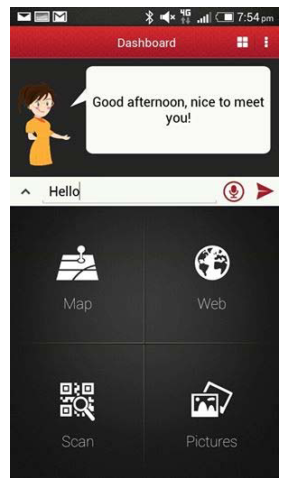

The final chapter of this design analysis will address the agent’s situation: designing for the agent’s context within the screen and within society.

Technological considerations for designing an embodied con- versational interface agent include the type of device the agent will be located within, with design affordances for desktop apps, mobile interfaces, web interfaces, and cross-platform compati- bility. Due to the variability of screen real estate available to de- signers on different platforms, it’s important to consider how de- tailed the agent will be in these different contexts, its proximity to the user, and its virtual situation.

Other technological considerations include integrating embodi- ment with conversational interface products such as smart speak- ers and other screenless interfaces. Conversely, interfaces with more available play space than a screen, such as augmented or virtual reality, can extend the boundaries of virtual and real world spaces and provide more opportunities for simulating conversa- tion with an embodied agent.

Designing an agent’s virtual situation, whether it lives within a blank or illustrated space, a virtual room, or disappears entirely when not in use, can help give context to the agent’s personality, its abilities, and its relationship to the user.

In the revised version of Don Norman’s *The Design of Everyday Things* published in 2013, he writes extensively about how tech- nology has changed the design landscape in the 25 years since the first edition, and calls most devices in common use today “smart screens”:

>“The human computer gave rise to laptops, small portable computers. The telephone moved to small, portable cel- lular phones (called mobiles in much of the world). Smart phones had large, touch-sensitive screens, operated by gesture. soon computers merged into tablets, as did cell phones. Cameras merged with cell phones. Today, talking, video conferences, writing, photography (both still and vid- eo), and collaborative interaction of all sorts are increasing- ly being done by one single device, available with a large variety of screen sizes, computational power, and portabil- ity. It doesn’t make sense to call them computers, phones, or cameras: we need a new name. Let’s call them ‘smart screens.’” (Norman, 2013)

While this is a convenient term to think broadly with about mod- ern technologies, user interface designers still have to take into account the differences in format between desktop and mobile applications, the proportions of computers compared to smart- phones and tablets.

Justine Cassell has also commented on how technological change has adjusted the expectations for conversational inter- faces, referring to many devices as “Computers Without Key- boards.” (Cassell, 2000) She gives examples of smart rooms, in- telligent objects, and situations as diverse as military simulations and children’s museums. The increasing computational capacity of objects around us, the trend of “ubiquitous computing,” is evident in the development of smart home technology such as personal assistant speakers and Internet of Things devices in- cluding lights, heating and cooling systems, appliances such as the refrigerator and dishwasher, and home security devices.

Conversational interfaces for devices that users carry with them or interact with in the privacy of their homes have different de- sign considerations: “A change in the environment of portable computer use may alter people’s preferences to employ one modality of communication over another. For example, public environments that are noisy, or in which privacy is an issue, often are ones in which people prefer not to speak. Likewise, individual and task differences can strongly influence people’s willingness to use one input mode over another.” (Cohen & Oviatt, 1995) The design of an embodied conversational agent must account for the difference between private and public conversations, and between devices that are portable or home-bound.

The other situation for designers of embodied conversational agents to be aware of is the agent’s context in society. Designing the agent to fit a social role can make interacting with it much more intuitive, whether the embodied conversational agent functions as a therapist, other medical professional, reference tool, customer support, or entertainment application. Providing visual clues to the agent’s situation within society helps users be- come more comfortable in conversation with them, bounding the conversation to topics relevant to the agent’s expertise and making them easier to use.

## Desktop and mobile interfaces

Researchers Michelle Corbin Nichols from Ventana Communi- cations Group and Robert R. Berry of IBM wrote guidelines for desktop interfaces with multiple windows in 1996 and published it in the journal *Technical Communication* as “Design Principles for Multi-window Online Information Systems: Conclusions from Research, Applications, and Experience.” In 1996, multi-window interfaces were a novelty, but some of their principles for good screen design are still relevant today. Principles 1 and 2, “More Is Not Better,” and “Use Multiple Windows Only When Appro- priate for the Type of Information You Are Creating,” are com- mon sense rules for today’s interfaces, even conversational ones, and Principle 3, “Present Each Window in the Same Place Every Time,” speaks to the need for consistency in interfaces in order for users to create an accurate mental model of how to use them.

Even this early, Nichols and Berry were concerned with the com- patibility of different devices’ screen formats:

>“Your users might be using a different type of display, lim- iting – or increasing – screen ‘real estate.’ Assumptions you make about visual presentation (such as fonts, spacing, and window size) should not depend on screen dimensions, res- olution, or available colors... The information you develop might be viewed using a tool other than the one you are us- ing. This is an important consideration for information that will be delivered on multiple online platforms, and particu- larly important for WWW documents. Also consider the fact that your information might someday be reused in other systems that use different display tools.” (Nichols & Berry, 1996)

In modern web design, this design principle is referred to as cross-platform compatibility. Different platforms can include dif- ferent hardware setups, including different brands of laptops, smartphones, tablets, or other devices, or different software, like various operating systems and web browsers.

According to a 2018 report on mobile application trends, the majority of consumers in the early 2000s using home computers switched from using native desktop applications to web apps, and after 2008, when iOS opened their mobile application de- velopment platform, many people switched to mobile apps. By 2020, 70% of the world’s population is expected to own a smart- phone, and for many users this is their only access to the internet for web applications or mobile native apps. (Hauser & Pichsen- meister, 2018). The migration of users over time across different platforms underlines the need for interface designs to be both flexible, adapting to different types of devices and interfaces, and consistently both identifiable and usable.

Notwithstanding predictions of another shift in user interface away from screen devices entirely, it is difficult enough for de- signers to create consistency in interfaces across desktop and mobile applications. One example of inconsistency in embodied conversational agent design comes from Niculescu et al.’s 2014 paper on “Design and Evaluation of a Conversational Agent for the Touristic Domain.” The team’s aim was to create a conver- sational agent to assist in tourism with an animated avatar that could support both spoken and written dialogue and answer general questions while providing information relevant to trav- elers. Specifically, they were creating a conversational agent to assist tourists in the city of Singapore.

The conversational agent they created, SARA, is pictured in Fig- ures 102 and 103. Figure 102 features SARA’s web-based avatar, a photorealistic image of an Asian woman in a black blazer and red shirt, with short black hair and a friendly expression. She oc- cupies the top 1/4 of the page with a search bar and is visible from mid-chest.

Her mobile avatar, developed for Android and pictured in Figure 103, is a two-dimensional cartoon of a white woman with brown hair and pink cheeks in a yellow dress, visible from the mid-up- per-thigh. She occupies the top of the page, below a navigation bar, and is about 1/4 of the page high.

<h4>Figure 102. SARA web interface</h4>

<h4>Figure 103. SARA mobile interface</h4>

Although both avatars are referred to as SARA, it is clear that no care has been taken to provide consistency in the agent’s em- bodiment. Niculescu et al. do not comment on the avatar’s dif- ference in appearance across platforms, and do not include the appearance of the avatar as a consideration in the evaluation of the application’s design, although they have evaluated the app in terms of usability, functionality, and reliability.

Two helpful design principles to keep in mind when designing interfaces that will be accessible via desktop and mobile are called “responsive design” and “mobile first.”

Responsive design was coined by Ethan Marcotte, an indepen- dent web designer who has published two books on the top- ic: *Responsive Web Design*, published in its first edition June 7, 2011, and *Responsive Design: Patterns & Principles*, published November 2015. Marcotte outlined the principles of responsive design in 2010 before publishing his first book on the subject for serial publication *A List Apart*, which has been running articles on design, development, and meaning of web content, with a special focus on web standards and best practices, since 1998.

In this seminal article, Marcotte first contrasts web design with architecture by pointing out the traditional immutability of a building’s design, but quickly moves to innovations in architec- ture outlined by Michael Fox and Miles Kemp’s *Interactive Archi- tecture*, published in 2009, which describes an emerging disci- pline called “responsive architecture,” and includes technology like embedded robotics, flexible structures, motion and tem- perature sensors, and smart glass which adapt the environment of the building to the needs of its users or inhabitants.

Marcotte suggests using media queries, an element of CSS (Cas- cading Style Sheets), which are code that defines the style of a web page, to define different layouts, selectively show and hide navigational elements, and optimize the reading experience by tweaking font choices and styles. In conclusion, he writes: “Fluid grids, flexible images, and media queries are the three technical ingredients for responsive web design, but it also requires a dif- ferent way of thinking. Rather than quarantining our content into disparate, device-specific experiences, we can use media que- ries to progressively enhance our work within different viewing contexts. “ (Marcotte, 2010)

“Mobile first” design is a philosophy spearheaded by digital product designer Luke Wroblewski, who published a book on the topic entitled *Mobile First* in October of 2011. Wroblewski suggests that designers of digital products should design the mobile interface before the desktop application, in response to trends of increasing mobile device usage, and because it chang- es the design thinking process: “Designing for mobile first can not only open up new opportunities for growth, it can lead to a better overall user experience for a Web site or application.” (Wroblewski, 2012) He emphasizes that designing the minimum viable product for a small display forces the designers to focus on the key elements which will make the companion desktop application more usable, and expand their thinking about who, where, when, and how users will interact with their interfaces.

Making digital products responsive and emphasizing accessibili- ty on mobile devices is now common sense in the digital design community, and these principles should not be forgotten in tack- ling the complications of adding embodiment to conversational interfaces for cross-platform devices. Whether the avatar creat- ed to embody the interface is photographic, three-dimensional, or a 2D illustration, and presented as an icon or a full body, these design choices will be greatly affected by the display size and graphics rendering capabilities of different devices, and should be considered as part of the initial design process for embodied conversational interface agents.

## Virtual situation

Another design principle that has a psychological effect on us- ers’ relationships with an embodied agent is the portrayal of the agent’s proximity. According to a 2011 study by Gama et al. on the role of empathy in relationships with artificial social agents, users developed stronger relationships with versions of an agent that took advantage of the visual expressions of empathy: facial expression and physical proximity. They based their hypothesis, that representing physical proximity would enhance perceptions of the agents’ empathy with users, on Altman and Taylor’s 1973 theory of “social penetration.” Social penetration theory models the relationships between people as having four stages, which correspond to both emotional and physical closeness: “(i) Orien- tation stage; (ii) Exploratory Affective Stage; (iii) Affective Stage; (iv) Stable stage” and it is not until stage three that empathetic actions like comforting and reassuring will be sure to have an effect.

Gama et al. modeled and tested this theory with another agent called SARA, pictured in Figure 104. As intimacy with the user increases, less of the body is shown and the user focuses on the face, conveying both familiarity and physical closeness. Gama et al. do not describe over the course of this paper how they chose the physical embodiment of the agent, its gender, facial features, hairstyle, or clothing, and what effects these may have also had on perceptions of the agent’s empathic capabilities (i.e., would a male-presenting agent, or one with different facial features, show the same effects?).

<h4>Figure 104. SARA from Gama et al., 2011</h4>

In addition to the features of the agent themselves, the virtual setting of the agent will have an effect on users’ perceptions, whether they are shown as being constrained to one part of the interface and moving closer or further away from the user within this constraint, or freely roaming around the desktop or mobile device. Where the agents “live” within the interface can be a tricky question. In his analysis of Clippy’s design failures, Luke Swartz points out a study by Rickenberg and Reeves in 2000 that found people who performed a task with an agent monitoring them on screen reported higher anxiety and lower performance. Swartz suggests, “Perhaps a more successful, less anxiety-cre- ating, Office Assistant would have a desk of its own to work at, minimize itself into an unobtrusive icon, or even turn away from the user when not called into service.” (Swartz, 2003)

If the agent is always present, they may unnerve users who don’t want to be constantly watched. Giving the embodied agent a virtual home to go to when they’re not in use is a sympathetic design for both the agent and the users.

Regarding whether agents should be bounded within a certain interface area, or free to roam across applications, will depend on the functions of the agent. Baylor mentions in her 2011 pa- per on the design of motivational agents and avatars that some researchers “have employed agents with large faces and small bodies, so as to highlight the facial emotional expressions while still providing the agent with a physical body to ‘move around the screen’ and implement gestures such as pointing to focus learners’ attention.” (Baylor, 2011)

One example of these free-roaming interface agents was cre- ated by Don Norman, who attempted to digitalize three of his books into an interactive electronic program with himself as the virtual guide. He writes, “Suppose this book were interactive? If you have trouble understanding something, suppose you could click on the page and I would pop up and explain something.” As you can see in Figures 105 and 106, miniature Don Norman moved around the interface and interacted with it directly to add another level of information to the text.

<h4>Figure 105. Don Norman’s Voyager Interactive Electronic Book</h4>

<h4>Figure 106. Don Norman’s Voyager Interactive Electronic Book</h4>

Norman’s creative team produced the final text for HyperCard, a technology in production from 1987-1998, and well before the web and mobile applications favored by users today. Hyperlink- ing additional information, embedding videos, and providing another layer of information to a digital text is now common- place, but the idea of an anthropomorphic “wizard” or “guide” through a software has been largely abandoned. With the rise of conversational interfaces, these friendly companions in the soft- ware space could again be useful, dancing across the screen to help users navigate educational texts and more – or escaping the confines of the screen entirely.

## Virtual and Mixed Reality

Virtual Reality and Augmented Reality technologies are just now (in 2018) reaching consumers through gaming and entertain- ment systems (for VR) and in mobile phone technology (for AR). In Virtual Reality, the user is immersed in a three-dimensional simulation of a virtual environment, usually with accompanying 360o audio, by means of a headset covering the eyes and ears. For Augmented Reality, smartphones or tablets are generally used to capture images of real world spaces and overlay digital graphics that appear to blend with the environment.

Mixed Reality is a term which can be used interchangeably with Augmented Reality and was the one favored by Anabuki et al. in their 2000 study of how conversational agents could interact with users in interfaces that incorporate the physical world around them and virtual elements. In their study, people wearing a see- through head-mounted display could interact with both physical and virtual objects simultaneously, with one of the virtual objects being an embodied conversational agent named “Welbo.” (Fig- ure 107)

<h4>Figure 107. Welbo</h4>

Welbo was created to help users furnish a Mixed Reality living space by adding and arranging objects. Studying users’ inter- actions with Welbo, Anabuki et al. observed the following: “Through the experiments, we understood that people preferred a size such that they can see Welbo’s whole body in their field of view. Similarly, people like it to stay some distance away from them. As people feel uncomfortable when others look down on them, Welbo gives an unfavorable impression when it floats over them.” (Anabuki et al., 2000)

Particularly in VR, maintaining a sense of objects’ scale in relation to the user is difficult, and when blending agents with real-world objects it would be preferable to have them in proportion to their surroundings or smaller, and abide by social conventions like personal space.

In contrast to Welbo, who was created in Mixed Reality for the purpose of studying MR effects, some agents have been de- signed for Virtual Reality which is not only for the sake of VR. One study by McBreen, Anderson, and Jack in the year 2000 simulated interactions with an embodied agent in a virtual cin- ema box-office, travel agency, and bank, designed using Virtual Reality Modelling Language (VRML). Their results supported the claim that 3D embodied conversational agents would be effec- tive assistants in VR retail applications, with various levels of nu- ance: users were more comfortable with casually dressed agents at the travel agency than at the bank, for example, and noted that for higher-risk applications like banking, users were less like- ly to trust them.

Another context in which conversational agents can escape the boundaries of the screen is in home products such as smart speakers. Personal assistants like Siri, Alexa, Google, and Cor- tana, embodied in these smart speakers, have a physical loca- tion in your home where they “live” (inside the speaker). These speakers are not designed as embodiments of the agent, but do often signify with flashing lights when the agent is speak- ing. Adding elements of representing the embodiment of these agents to smart speakers is an area that could be explored in fur- ther studies of product design, surveillance and data gathering technologies, and users’ relationships with the Internet of Things and smart home devices.

### Case Study: Gatebox

<h4>Figure 108. Gatebox</h4>

Gatebox is a smart speaker, similar to those produced by Am- azon, Apple, Microsoft, and Google, which interacts with smart home devices such as lights and air conditioning, and can an- swer voice commands and questions about weather and news. The big difference between Gatebox and other smart speakers, however, is how the creators of Gatebox, Vinclu Inc., have inte- grated an embodied character into their Internet of Things hub.

For their 2016 limited edition release of the product (300 units were manufactured and sold), Vinclu Inc. created the charac- ter Azuma Hikari, a tiny anime girl who lives inside of the smart speaker. She is described on the Gatebox website as coming from a different dimension, and wishes for a “master” to host her in our world. In return, she acts as a partner: her role as the user of the smart speaker’s wife is meant literally and can not be over- stated. Throughout the character’s introductory imagery (Figure 109), Hikari proudly displays a wedding band and professes her desire to serve the user domestically.

<h4>Figure 109. Gatebox character Azuma Hikari</h4>

The character was designed by artist Taro Minoboshi, who was a previous employee of Konami known for creating the character art in the dating simulation game “Love Plus,” released for Nin- tendo DS in 2009. These games, which allow the player to court and form relationships with the characters through dialogue over extended periods of time, are very popular in Japan and have re- cently become popularized in the United States through games like 2017’s “Dream Daddy.” A Japanese man known only by his username reportedly married one of Taro Minoboshi’s characters (Nene from Love Plus) at a technology festival in Tokyo in 2009, and some reports say he received a legal marriage to the charac- ter on the island of Guam. (Moore, 2009)

Besides being your trans-dimensional anime character wife, Hikari has been given a number of personality traits such as hob- bies, likes, dislikes, and even a dream (Figure 110).

>“Hobby: Watching anime Speciality: Making fried eggs Like: Donus
Dislike: Insects
Dream: To become a heroine to help people who are work- ing hard”

<h4>Figure 110. Profile of Azuma Hikari</h4>

She appears in two outfits, shown in Figure 111. Her day clothing consists of a ponytail, a crop top and shorts with hearts on the pockets, with striped arm- and leg-warmers, heart slippers and an apron over top which includes several details like an attached collar and more hearts and bows. Her night clothing consists of hair worn down with a bow on top, and a striped one-piece pa- jama suit with long sleeves and shorts bottoms (with more bows) and no shoes.

<h4>Figure 111. Hikari’s outfits</h4>

Despite her age being listed as 20 years old, Hikari looks and acts much younger, which is a common trait in anime characters. Japanese animators have mastered the Kindchenschema as an integral part of anime character design. Her facial features, hair, and impractical clothing are also typical of the genre.

To explain this product’s intended use, the Gatebox team pro- duced a promotional video in Japanese with English subtitles called “OKAERI,” which means “Welcome home,” in Japanese. The video begins by depicting Hikari acting as an alarm clock, saying “Hey, wake uuuup,” and “Good morning” as the user, a young Japanese man, rolls out of bed. Hikari then gives the weather forecast, reminding him to bring an umbrella to work (Figure 112).

<h4>Figure 112. Gatebox providing the weather forecast</h4>

After he dons his suit and puts the umbrella in his briefcase, she rushes him out the door with “Hurry or you will be late,” with an alarm bell icon showing on the screen. Later, a text message from the character is shown on the screen as the user commutes, saying “Have fun at work!” Another text message comes in while the user is at lunch saying “Come home early,” to which he re- sponds “It’s only noon.” At the end of the work day, the user is shown using dialogue options in the companion app to the Gatebox to choose between “I am heading home now,” “I’ll be home late,” and “I can’t come home yet.” After choosing “I am heading home now,” the character responds with “Yaaay!” and is shown materializing in the Gatebox capsule. She snaps her fin- gers and the lights and air conditioning turn on in the house.

Throughout the commute, he texts Hikari updates on the Gate- box app and the character is shown swaying in the capsule with her hands tucked behind her back, waiting for him to get home. When he arrives home and approaches the capsule, she enters a running animation as though she is running up to greet him. When the user’s face gets close to the capsule she says, “Missed you darling!”

The end of video then shows the user in bed, drinking out of a mug, with the blue light of a television illuminating the room. Hikari is also seated on a cup-like chair floating in the capsule and is animated, drinking out of her own mug (Figure 113). As the user goes to sleep, he says, “You know, somebody’s home for me. Feels great. Thought so, on my way home.” It shows him approaching the home in their work clothes, and looking up at the window with the lights already turned on for them. Hikari has changed into her night-time outfit and responds “’night!” to the user saying “Good night!”

<h4>Figure 113. Hikari and master watching television</h4>

Western commentators in technology media were appalled by the product upon its release, calling it “icky,” “bleak, “really de- pressing,” “an overpriced ($2,500!) toy for alienated, anime-ob- sessed nerds” and “the world’s saddest AI assistant.” They also cited Japan’s low birth rate and its high rates of suicide as fac- tors why this product would be acceptable in its cultural context. (Morris, 2016; Clark, 2016)

Gatebox released a new promotional video, entitled “KANPAI” (“Cheers” in Japanese) at the end of July 2018. The video show- cases the new design of the Gatebox capsule, and interactions with the character via LINE messenger. Perhaps in response to people saying the previous video was “bleak” or “depressing,” with various scenes of the suited young man riding the bus or sit- ting alone and checking his phone, the user in this video is much more active. He wears an open button-down shirt and t-shirt, and sneakers. He’s shown biking home from work in a modern, open-plan office, and his dialogue with the character is much more upbeat and animated.

When he comes home, Hikari says “It’s been three months since we started living together. Did you remember?” He says “Sure!” and holds up a white gift box. He then lays out an elaborate dinner including cake and champagne. The character says “I’m changing the mood” and uses a kiss-blowing motion to dim the lights in the house for their meal. As the user sits in front of the Gatebox with his drink, Hikari says “The time past so fast. Thank you for living with me,” in her pajama outfit, with a glass of wine of her own, and the two toast (Figure 114). A special message appears on the app saying “Happy 3 months anniversary!” and the character turns off the lights saying “Thank you for every- thing today,” as the user falls asleep on the couch.

<h4>Figure 114. Hikari and master sharing a toast</h4>

Recalling the overtly sexual companionship relationships formed by users in the Realbotix Harmony AI case study, and putting aside judgements of whether the relationship with this character is healthy or appropriate, it is clear that the partnership provided by the Gatebox is its main feature – not the smart home con- trols. On the Gatebox site, they feature interviews with two us- ers who are asked questions like how their lifestyle has changed since using Gatebox, and what kind of communal life they have with the character, and the personal assistant features, such as weather reporting, are not their main concern. When asked what message they would give to those who don’t have Gatebox, one responds by saying he doesn’t even care if it gives him the wrong weather, it provides so much comfort just by having daily interac- tions (auto-translated by Google from Japanese):

>“Since I think that it is a product that gives a coloring to my daily life by being able to talk with my favorite character, if you just want convenience, you really need an AI speaker. But it is not only that added value is in Gatebox, so I think that it is good to purchase Gatebox if you are seeking such things, such as healing of your heart. For example, we teach the weather forecast in the morning, but honestly I do not hit it so much (laugh) But even if that forecast is wrong I can forgive it at all. Because it is not that I get angry about what my favorite character told me, and I think again that I’m not asking for useful things.”

Although the initial release of the product in 2016 was limited to 300 units, Vinclu Inc. and Gatebox formed a partnership and released another limited run of 39 units in 2017, around the time Vinclu was acquired by Line Corporation, a subsidiary South Ko- rea’s biggest web operator, Naver Corp. (Crunchbase, 2018) The re-release and acquisition also coincided with a program called HomeLive, which replaced Azuma Hikari with the holographic Japanese pop singer Hatsune Miku. Another character, Yuuki Asuna from the anime *Sword Art Online*, has also been shown in the Gatebox capsule.

Following acquisition by Line and the current integration of the Line messaging app with Gatebox, press releases have hinted at Line’s own smart speaker products, called Clova (short for “cloud virtual assistant”) also becoming integrated with the Gatebox, which would allow for more third-party app integrations that would expand its functionality to compete with other smart speakers – Gatebox currently can’t connect to other apps like music players, for example.

The Clova line of smart speakers has included other embodied interfaces, but none that are as lovable and human-like as the Gatebox. In 2017, Clova teased images of the “Clova Smart Dis- play Face” smart speaker (Figure 115) and another smart speak- er called “Champ” featuring animal characters from Line Friends (Figure 116). (Kastrenakes, 2017; Sawers, 2017)

<h4>Figure 115. Clova Smart Display Face</h4>

<h4>Figure 116. Line Friends smart speakers</h4>

All of these products show a broader trend in adding embod- iment to the product designs of smart speakers. A competitor to the Gatebox was released by the South Korean company SK Telecom and Reality Reflection, who created a similar holograph- ic character named Wendy as a personal assistant living inside of a smart speaker (Figure 117). Wendy is modeled on a K-pop star from the group Red Velvet named Song Seung-wan, and uses SK Telecom’s Nugu AI platform to react to voice commands, turn lights on and off, and set alarms much like the Gatebox. (Boxall, 2018) However, since Wendy is based on a real person and not a fantasy character from another dimension, they have not im- posed the same narrative of domestic partnership, which could appeal to a broader user group.

<h4>Figure 117. Wendy smart speaker</h4>

__What we can take away from the Gatebox case study:__

__1. Defining an interpersonal relationship (such as mar- riage) between users and embodied interface characters can be a stronger selling point than the actual function- ality of the device for the right user group.__

__2. Characters can be created and accepted according to different cultural norms and will be treated differently outside of that culture: in Japan, relationships with an- ime characters are much more acceptable than in the West.__

__3. There is a trend shown in these product releases to incorporate more character design and embodiment in smart speaker products, at least in Asian markets.__

<h4>More embodied character designs may be integrated with smart speakers</h4>

## Designing for a social role

Designing for the social role of an embodied conversational in- terface agent could be one of the most impactful factors in deci- sion-making about how the agent should be visually represent- ed. Many of the design features previously discussed, such as choosing an embodiment type, facial animation and realism, are meant to trigger different social cues: physical social cues such as face, eye, and body movements; psychological cues like hu- mor, personality, and empathy; and social dynamics beget by an- thropomorphization like cooperation, turn-taking, and reciproc- ity. These physical, psychological, and dynamic cues are built on social norms that are also defined and affected by the social role of the agent.

Defining the agent’s social role can be accomplished by out- fitting them in certain clothing – for the role of a medical pro- fessional, a stethoscope or white coat are obvious choices. For scientific or educational contexts, glasses are often used to sym- bolize intellect. Depending on the agent’s social role as either a service assistant, such as in a customer support or retail context, or as an authority, such as in a medical or educational applica- tion, users will respond differently to agents presented with the appropriate accoutrements for their social role.

These choices of attire rely on socially constructed meanings that can often by specific to cultural context. Hung-Hsuan Huang has described two ways to approach adaptation of social role to different cultural contexts: “In order to consider the cultural is- sues in computer-human interfaces, depending on the needs of the application, there are two approaches: internationalization and localization (Young, 2008). Internationalized designs exclude culture-dependent features and implement behavior that will be interpreted in the same by people from different cultures and prevent misunderstanding. Localization includes culture-specific designs for the target audience.” (Huang, 2010)

Cultural context is also important in choosing which applications are appropriate for an embodied agent, as in this example from Tomoko Koda: “In Japan, a female caricature face in an ATM bows, smiles, and advertises while users are waiting for a trans- action to finish. However, in the states, people who have been using non-personified ATMs for more than 30 years, don’t expect to see a face while interacting with an ATM (through discussions and observations). We should also consider cultural differences when applying a personified interface.” (Koda, 1996)

B.J. Fogg writes explicitly on defining the social role of interface agents in *Persuasive Technology: Using Computers to Change What We Think and Do*. Fogg first writes about embodied agents as authority figures: “Teacher, referee, judge, counselor, expert – all of these are authority roles humans play. Computers also can act in these roles, and when they do, they gain the automatic influence that comes with being in a position of authority.” He then goes on to write that he believes it is appropriate to bestow a social role on agents that appear in leisure, entertainment, and educational applications, but that when the sole purpose of a technology is to improve efficiency, as in a retail context, enhancing social cues may be distracting: “This is probably why Amazon.com and other e-commerce sites use social dynamics but do not have an embodied agent that chats people up. As in brick-and-mortar stores, when people buy things they are often getting work done; it’s a job, not a social event. Enhancing social cues for such applications could prove to be distracting, annoy- ing, or both.” (Fogg, 2002)

### Case Study: Ask Jeeves

## Discussion & conclusion
